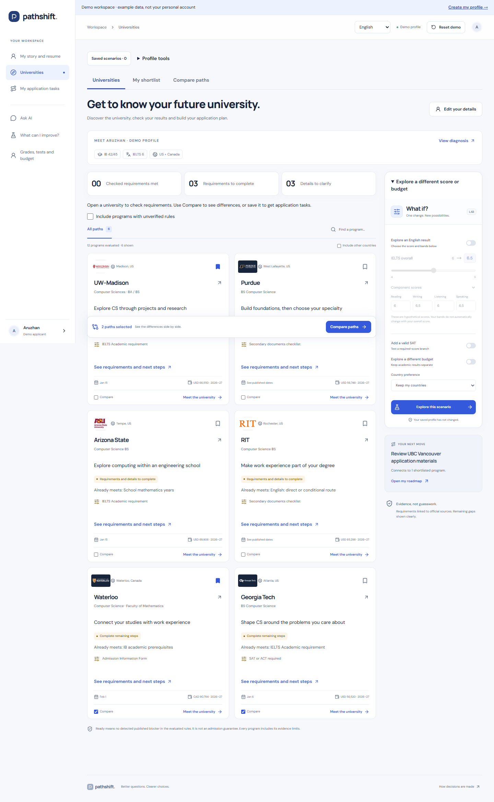
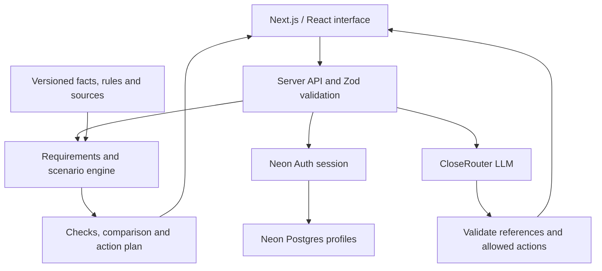

# PathShift

### From “Where should I apply?” to a clear next step.

**AG Team · Русский / Қазақша / English**

[Live product](https://pathshift-locus-2026.vercel.app/) · [Explore the demo](https://pathshift-locus-2026.vercel.app/demo?view=portfolio) · [Pitch and demo script](docs/pitch-script.md)


A personal admissions route: understand your starting point, review supported university options, compare requirements and costs, and follow a concrete next action.

**LOCUS Hackathon 2026 — Case 2 (`LOCUSCASE2`).**

- Product: https://pathshift-locus-2026.vercel.app/
- Explicit synthetic demo: https://pathshift-locus-2026.vercel.app/demo
- Repository: https://github.com/abdumutalipabay0/pathshift-locus-2026
- Audience: international first-year applicants exploring Computer Science in the US and Canada, Fall 2027. The strongest automated academic mapping is IB. Other credentials can retain unresolved checks.

## User journey

1. Read the landing page, then register or explicitly explore the synthetic demo.
2. Registration uses Neon Auth. Initial setup asks age, citizenship, destinations and optional interests; grades and budget can be added later. New applicants start with their story and resume.
3. University discovery shows a diagnosis grounded in evaluated rules: confirmed requirements, known gaps and missing information. An incomplete profile is labelled exploration.
4. Review up to three candidates from the six supported universities, with reasons and cautions. Selection follows the existing server ordering and respects country constraints, missed deadlines and hard reference-budget limits. The app does not invent matches to fill three slots.
5. Compare up to three universities. Saving a university to the shortlist creates its application tasks; comparison selection is separate.
6. Follow exam, document, date, academic-preparation and interest-based activity tasks. One next task is highlighted. Completion records progress and never supplies a test score or verifies a university fact.
7. Try hypothetical changes without overwriting actual results. Return to the real profile to record achieved results.

The supported cohort is UW–Madison, Waterloo, Georgia Tech, Purdue, RIT and Arizona State. Six additional research programs are opt-in. These are not a global ranking. The interface supports English, Russian and Kazakh.

## Product highlights

| Feature                  | What the applicant gets                                                                                            |
| ------------------------ | ------------------------------------------------------------------------------------------------------------------ |
| **My story and resume**  | Interests, projects, competitions, research, community responsibility and goals; AI helps describe real experience |
| **University profiles**  | Official logos, real photographs, history, distinctive features and linked sources                                 |
| **What do I need?**      | Your score beside the verified threshold, the shortfall, completed checks and alternative routes                   |
| **Compare and simulate** | Up to three choices, dated costs and hypothetical changes without overwriting actual results                       |
| **My application tasks** | Saved universities, documents, exams, preparation, a highlighted next action and persistent progress               |

Main navigation: **My story and resume → Universities → My application tasks**. Shortlist and comparison are grouped within university discovery. Twelve programme/campus records have descriptive profiles; Toronto St. George and Scarborough are separate entries, not separate universities. Complete descriptive profiles do not imply complete admission rules for every entry.

<details>
<summary><strong>View the actual university workspace</strong></summary>



Captured from the deployed product during the 19 September 2026 browser verification.

</details>

## Run locally

Node.js 22+ and npm; browser tests use installed Google Chrome.

```sh
git clone https://github.com/abdumutalipabay0/pathshift-locus-2026.git
cd pathshift-locus-2026
```

```sh
npm ci
npm run dev
```

The public landing and `/demo` work without an account database or LLM key. For **real accounts**, copy `.env.example` to `.env.local` and configure `DATABASE_URL`, `NEON_AUTH_BASE_URL`, and `NEON_AUTH_COOKIE_SECRET`. Initialize storage with `node --env-file=.env.local scripts/init-accounts.mjs`. Configure localhost and the production origin in Neon Auth. The deployed service is already configured.

For optional AI features, set server-only `CLOSEROUTER_API_KEY`. `SCENARIO_MODEL` selects the scenario parser; `ASSISTANT_MODEL` selects the assistant and resume coach. Both default to provider identifier `google/gemini-3.7-flash`. This is a provider-listed name, not independently authenticated model identity. Without the key, deterministic evaluation and scenario controls still work. Never put secrets in `NEXT_PUBLIC_*`, source files or Git.

Production commands: `npm run build`, then `npm start`. Deploy with Vercel after setting the server environment. Git push alone does not publish this project; its deployment uses the Vercel CLI.

## Architecture and technical disclosure



Next.js App Router, React, TypeScript and a pure server-side rules engine. Zod validates profile updates and AI operations. Versioned JSON separates source facts, rules and UI. The browser never imports the admissions engine. Evaluation and simulations use the same pipeline.

Neon Auth manages email/password sessions. Neon Postgres stores profiles by verified session user ID. Actual profiles, shortlisted universities and task progress are account-backed; unfinished drafts, saved scenarios and comparison selections remain browser-local and scoped per account. The explicit demo uses local browser storage and never populates a real account.

The scenario composer uses CloseRouter to parse explicitly submitted scenario text. The server validates an operation allowlist and requires user preview/confirmation. The model does not decide admission eligibility or receive the full stored profile. Core admissions checks are deterministic.

The separate **AI admission assistant** (`/app?view=assistant`, public synthetic `/demo?view=assistant`) explains the saved profile, requirements, comparisons and preparation, with canonical evidence links and a next-action button. It uses CloseRouter with `ASSISTANT_MODEL` (default `google/gemini-3.7-flash`). Each explicit question sends selected academic profile fields, computed results and the latest three conversation turns. Name, account email, citizenship, raw grade text and personal-plan notes are excluded automatically; users must not type private documents into questions. The assistant cannot edit records, submit applications or mark progress. Conversation is held only in page memory and resets on navigation, locale change or profile update. The privacy page and request form disclose this transfer.

The **applicant resume coach** (`/api/profile-coach`) receives only interests and experience notes, not account identity, email or grades. It asks a focused follow-up or drafts resume bullets. Each bullet requires a literal source quote from the notes; the applicant reviews, edits and explicitly approves saving. Quote validation is not full semantic verification. Approved content persists with the account and can be downloaded as text or printed/saved as PDF. Editing notes preserves an already approved resume. Cancellation or provider failure preserves the draft. Its eight-request/minute limit is process-local.

Assistant source IDs and program destinations are constrained by the current server context and revalidated. Source URLs come from the dataset, never the model. This guards references and actions but cannot prove every generated sentence is faithful; the interface asks users to verify evidence. No live web search or admissions probability model is included. Provider failures preserve the profile and leave the ordinary roadmap usable. The six-request/minute IP limit is process-local, not a distributed abuse-control system.

Components and tools: Radix Dialog, Lucide icons, self-hosted Manrope/DM Sans/Noto Sans, Playwright, axe-core, ESLint and Prettier. Neon is a managed external auth/database service; Vercel hosts the application. OpenAI Codex assisted research follow-up, implementation, design and testing under the project owner's direction. User-supplied research is preserved. Generated campus illustrations are decorative, not photos or evidence about actual universities. University cards and profiles now use official logos and real university photography: [asset sources](src/lib/university-media.json), [history and notable-feature sources](src/lib/university-profiles.json). Marks belong to their institutions and do not imply endorsement or affiliation.

## Three-minute demo

See [the current timed pitch and demo script](docs/pitch-script.md) and [submission checklist](docs/submission-demo.md). All applicant values below are **synthetic demo data**. The walkthrough below is an additional technical test; the current pitch uses UW–Madison and Waterloo with a focused IELTS scenario.

1. Open `/demo?view=map`, reset the demo, then open profile diagnosis. Explain confirmed checks, known requirements and missing evidence.
2. Inspect a suggested university and its official source, then compare Waterloo with Georgia Tech.
3. In the real **demo** profile, enter IELTS overall 6.5 with reading/listening 6 and writing/speaking 6.5; SAT VALID, 1450, 2026-08-15. Confirm AIF and documents for Waterloo, UW–Madison and Georgia Tech after selecting those institutions. These three routes pass the implemented checks. 1450 is not an admissions cutoff.
4. Save the universities, open tasks and complete one review step. Reload to show persistence. Show an optional study/activity task and its planning-only label.
5. Demonstrate a hypothetical budget or test change; explain that actual data and admissions rules remain separate.

For a fresh-user walkthrough: sign up → short setup → initial diagnosis → add grades/budget → explained candidates → save → tasks. If using a shared judge account, use only synthetic data. Credentials must be shared privately in the submission form, never committed.

## Sources and honest limitations

Four authoritative documents are in `docs/case/` and `docs/research/`. Supplements preserve source URLs and provenance. Forum reports were discovery leads, not admissions evidence. Unknown facts remain unknown. No admission probabilities, GPA conversions, guaranteed aid or invented deadline dates.

Published 2026–27 cost references are separate from unconfirmed Fall 2027 totals. Not all credentials, TOEFL/DET branches or academic equivalencies are automated. Matching is limited to the supported cohort; interests inform preparation activities rather than unverified claims about university specializations. Reference affordability is not a confirmed all-in cost for the intended intake.

The app does not submit applications, send admission-office questions or deliver automatic deadline reminders. Calendar export includes sourced dates. Email verification is not enforced; mailbox delivery and password-recovery delivery are not verified. Concurrent editing across multiple devices has no conflict-resolution UI.

## Verification

**Verified 19 September 2026:** 99/99 automated tests and 67/67 browser scenarios on the deployed site. Real account creation/login/isolation, persistence, three languages, mobile layouts and automated accessibility checks are included. TypeScript, ESLint, Prettier and production builds passed. Browser AI tests use controlled responses; separate live-provider samples are documented. These are implementation checks, not user counts or admissions-outcome statistics.

```sh
npm test
npm run typecheck
npm run lint
npm run format:check
npm run build
npm run test:e2e
```

`PLAYWRIGHT_BASE_URL` targets a deployment. `RUN_ACCOUNT_E2E=1` enables real-provider QA signup/login/isolation tests; these remove only their reserved test accounts. See [validation](docs/validation.md) for executed results. Rebuild translations using `npm run i18n:build`; regenerate the dataset using `npm run data:build`.

## Repository guide

| Location                   | Purpose                                               |
| -------------------------- | ----------------------------------------------------- |
| `src/app/`                 | Pages and server API routes                           |
| `src/components/`          | Profile, university, assistant and roadmap interfaces |
| `src/lib/engine.ts`        | Requirements, scenarios and computed results          |
| `src/lib/profile-coach.ts` | Experience questions and reviewed resume drafts       |
| `data/dataset.json`        | Versioned facts, rules and dated references           |
| `public/`                  | Illustrations and official university media           |
| `tests/` / `e2e/`          | Domain, localization and browser checks               |
| `docs/`                    | Source documents, research, decisions and validation  |

[Latest functional release](docs/applicant-story-release.md) · [Source inventory](docs/source-inventory.md) · [Architecture history](docs/architecture.md) · [Pitch and demo](docs/pitch-script.md)

## Team, access and submission

**AG Team**

| Participant           | Contribution                                                                |
| --------------------- | --------------------------------------------------------------------------- |
| **Абай Абдумуталип**  | Primary product development: implementation of the website and its features |
| **Амирхан Адилжанов** | Idea development, assistance with the website, and presentation preparation |

The repository and development history are provided for technical review. Test-account credentials are shared privately in the submission form and must never be committed. Making the repository accessible does not submit the project to the competition.

The captain submits through AIstartify with code **LOCUSCASE2**. According to the supplied case, the deadline is **19 September 2026, 12:00 Astana time**. Required materials include a working URL, accessible GitHub/history, this README, a demo video up to three minutes, and a PDF presentation up to eight slides. The source documents remain authoritative; check organizer announcements for changes.

See [submission checklist and material outline](docs/submission-demo.md). Working software is not evidence that the project has been officially submitted.
