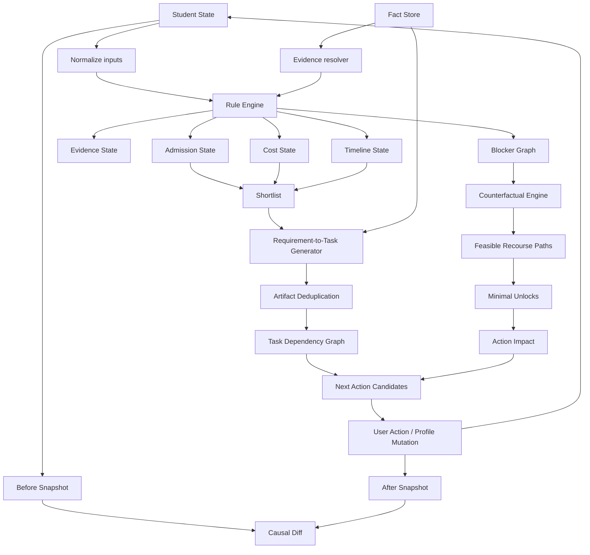

> Редакторское примечание к переносу, 2026-09-17. Ниже полностью сохранён предоставленный пользователем отчёт; admissions-факты при переносе заново не проверялись. Даты проверки и статусы VERIFIED внутри текста относятся к исходному исследованию.
>
> Provenance: OFFICIAL FACT / OFFICIAL_FACT — утверждение исходного отчёта об официальном источнике; PATHSHIFT INFERENCE / PATHSHIFT_INFERENCE — вывод или кодирование логики PathShift; PRODUCT ASSUMPTION / PRODUCT_ASSUMPTION — продуктовое либо тестовое допущение; UNKNOWN — неподтверждённое значение. Эти категории нельзя смешивать. Рекомендации по архитектуре, псевдокод и демонстрационные числа сами по себе не являются правилами вузов.
>
> Служебные маркеры цитирования ChatGPT (`cite…`, `filecite…`) сохранены как исходная provenance-разметка, но вне исходной беседы не являются самостоятельными доступными ссылками. Используйте явные URL в тексте; если точную связь claim → source URL → scope/intake установить нельзя, её статус остаётся UNKNOWN. Не восстанавливайте URL по догадке и не считайте повторяющиеся citation IDs в двух отчётах одним источником.
## Примечания для передачи Codex

- Источник: `2 ресерч чатгпт.md`, предоставленный пользователем. Основной текст ниже сохранён без сокращений и исправлений.
- Состав: 12 программ, entity hierarchy, HARD/SOFT/INFO и UNKNOWN, SAT/ACT и English logic, deadlines/cost/scholarships, FactRecord schema, 12 rule trees, 6 synthetic fixtures, матрица 12×6, 12 causal mutations, negative tests, program×rule matrix и remaining UNKNOWNs.
- Связанный концептуальный отчёт: [Decision Engine research](pathshift-decision-research.md).

### Неразрешённые расхождения исходного отчёта

Это редакторские наблюдения над предоставленным текстом, а не новые admissions-факты или исправленные expected outputs. Перед превращением примеров в исполняемые golden tests их нужно согласовать с evidence contract самого отчёта.

1. **Georgia Tech и UIUC: READY при неизвестной English logic.** Матрица и before/after пример допускают READY, хотя exact USG English predicate для GT и first-year numeric English threshold для UIUC оставлены UNKNOWN. Высокий IELTS сам по себе не восполняет отсутствующий predicate. В GT-примере вход также не содержит всех данных для показанного PASS secondary credential. Эти outputs не являются полностью воспроизводимыми из перечисленного raw input.
2. **Conditional pathways.** Наличие BASE или U of T English transition не подтверждает автоматически применимость пути к F_REACH/F_CONDITIONAL. В raw fixtures не заданы все условия этих путей; для U of T также не заморожены secondary prerequisites. Waterloo alternative branch не содержит явного полного academic gate. Не превращайте существование пути в доказанный PASS всех условий.
3. **Неполные fixtures и trees.** В объяснении Waterloo используется PASS AIF fixture, но AIF submission отсутствует в raw profile. Не для всех профилей указаны IELTS components, даты/валидность результатов и данные для feasible recourse. Некоторые JSON-узлы опускают обязательные по представленному TypeScript contract поля; source_fact_ids не сопровождаются полным набором FactRecord. Сохраняйте эти примеры как спецификационные заготовки, не как готовый валидированный JSON dataset.
4. **Cost scope.** Матрица использует W/O на основе reference costs 2026–27, хотя exact Fall-2027 COA остаётся UNKNOWN. Для Waterloo приведены tuition/incidental fees и books, а не полный annual COA. Явно отделяйте reference-cost comparisons от verified target-intake total cost; неполный subtotal не доказывает WITHIN_BUDGET для полной стоимости.
5. **Время и metadata.** В тексте указано `retrieved_at = 2026-09-17, Asia/Almaty`, а пример FactRecord содержит `2026-09-17T00:00:00+06:00`. Точное время извлечения не подтверждено предоставленными материалами. Пример не следует выдавать за фактический timestamp проверки.
6. **Состояния.** Сокращённая state machine говорит READY при отсутствии verified blocker, тогда как остальной контракт запрещает считать missing source за PASS. Матрица также содержит WITHIN_REACH при неизвестных критических фактах и timeline. При реализации требуется явно определить приоритет UNKNOWN, известных failures и доказанной feasibility; не обходить UNKNOWN ради совпадения с примером.

Исходные таблицы, числа, метки provenance и UNKNOWN ниже оставлены неизменными. Полнота переноса отчёта не означает, что все его expected outputs уже подтверждены или что все факты заморожены.

---
# PathShift Decision Engine — Implementation Dataset Freeze для Fall 2027

## Executive summary

Этот pass меняет статус проекта с «у нас есть логика admissions engine» на **«у нас есть контракт данных, по которому Codex может писать engine и при этом не выдумывать admissions rules»**.

Главный вывод после повторной проверки official sources на **17 сентября 2026 года**: для Fall 2027 нельзя честно заморозить все поля всех 12 программ как `VERIFIED`. Это не недостаток research — это важная часть спецификации. Некоторые университеты уже опубликовали admission-cycle deadlines на 2026–27 application cycle, ведущий к Fall 2027: Georgia Tech, UIUC, Waterloo и UBC дают достаточно конкретные даты; при этом у многих университетов **2027–28 cost of attendance ещё не опубликован**, а часть international/curriculum-specific rules не имеет достаточно узкого scope. Georgia Tech, например, уже публикует Fall-2027-cycle application/test deadlines, UIUC — Early Action и Regular deadlines, Waterloo — application/document deadlines, UBC — Fall 2027 application и document timeline. citeturn17view2turn19view1turn9view2turn11view2

Поэтому правильный freeze выглядит не как:

```text
everything has a value
```

а как:

```text
VERIFIED value
OR
PARTIAL value
OR
UNKNOWN

never invented value
```

Это особенно важно для Codex: **`UNKNOWN` должен быть реальным value, а не `null`, который разработчик потом «временно» заменит на 6.5 / January 15 / $70k.**

Сильнее всего заморожены следующие rule archetypes. Carnegie Mellon School of Computer Science требует SAT или ACT и admission идёт в SCS до последующего выбора/декларирования undergraduate major; Georgia Tech требует SAT/ACT от всех first-year applicants; UIUC для всех first-year applicants test-optional; UW–Madison сохраняет test-optional до Spring 2028; Waterloo даёт очень структурированные IB и English rules; UBC публикует точные English thresholds и Fall 2027 dates; University of Toronto уже формально описывает новый BCS с 1 сентября 2027 и отделяет admission category от последующего program enrolment. citeturn0search4turn15search8turn17view0turn18view1turn7view2turn9view0turn9view1turn11view1turn14view0turn14view1

Важный semantic contract для backend остаётся таким:

```text
admission_state:
  READY_TO_APPLY
  WITHIN_REACH
  CONDITIONAL_PATH
  BLOCKED
  INDETERMINATE

evidence_state:
  VERIFIED
  PARTIAL
  STALE
  CONFLICTING
  UNKNOWN

timeline_state:
  FEASIBLE
  TIGHT
  MISSED
  UNKNOWN

cost_state:
  WITHIN_BUDGET
  OVER_BUDGET
  UNKNOWN
```

`READY_TO_APPLY` в PathShift означает только:

> **No verified published hard blocker was detected for the selected application path.**

Он **не** означает admission likelihood. UIUC прямо описывает holistic review с test или без test, Georgia Tech также рассматривает standardized testing как только один из факторов holistic review; поэтому из baseline requirements нельзя честно выводить `87% admission chance`. citeturn18view1turn17view0

Вторая фундаментальная вещь: `admission_state`, `timeline_state`, `cost_state` и `evidence_state` нельзя сплющивать в один `match_score`. Например студент может быть:

```json
{
  "admission_state": "READY_TO_APPLY",
  "evidence_state": "PARTIAL",
  "timeline_state": "FEASIBLE",
  "cost_state": "OVER_BUDGET"
}
```

Это не противоречие. Оно означает:

> опубликованные admission blockers пройдены, но financial constraint пользователя не пройден, а часть неключевых evidence ещё не заморожена.

Именно такую модель я бы передавал Codex как **неизменяемый domain contract**.

## Frozen program dataset

Ниже `program_id` — **PATHSHIFT_INFERENCE / внутренний идентификатор**, не официальный код университета.

`retrieved_at` для источников этого freeze — **2026-09-17, Asia/Almaty**, если отдельно не указано иное.

Обозначения:

`OF` = OFFICIAL_FACT  
`PI` = PATHSHIFT_INFERENCE  
`PA` = PRODUCT_ASSUMPTION  
`U` = UNKNOWN

### Основной program table

| PathShift program_id | Official entity hierarchy | SAT/ACT | English | Entry structure | Fall 2027 freeze |
|---|---|---|---|---|---|
| `cmu_scs_cs_f27` | Carnegie Mellon University → Pittsburgh → School of Computer Science → undergraduate SCS admission → CS undergraduate program | **REQUIRED** | exact international threshold **U** in this freeze | SCS first, major declaration later | **PARTIAL** citeturn0search4turn15search8 |
| `gatech_bs_cs_f27` | Georgia Tech → College of Computing → BS Computer Science | **REQUIRED** | USG-approved method required; exact normalized threshold not frozen | first-year Georgia Tech application with intended major | **HIGH** citeturn17view0turn17view1turn17view3 |
| `uiuc_bs_cs_f27` | UIUC → Grainger College of Engineering → Siebel School → BS Computer Science | **OPTIONAL** | proof required depending schooling/test path; first-year numeric minimum not safely frozen | applicant applies with major choice | **HIGH / English threshold PARTIAL** citeturn18view0turn18view1turn18view2 |
| `purdue_bs_cs_f27` | Purdue → College of Science → Computer Science → BS CS | **U** | exact current undergraduate thresholds **U** | direct intended major, final admission logic holistic | **PARTIAL** citeturn21search0 |
| `uwmadison_cs_f27` | UW–Madison → undergraduate admission → Computer Sciences BA/BS declaration after enrolment | **OPTIONAL** | IELTS 6.5; DET 115; TOEFL rules versioned around Jan 21 2026 | university admission ≠ CS declaration | **HIGH** citeturn7view2turn6view0turn3search1 |
| `rit_bs_cs_f27` | RIT → Golisano College of Computing and Information Sciences → Computer Science BS | current exact test rule **U** | official international pathway exists in prior source set; exact direct/conditional thresholds require re-freeze | direct program application | **PARTIAL** citeturn22search0turn2search0 |
| `asu_bs_cs_f27` | Arizona State University → Ira A. Fulton Schools → Computer Science BS | **U** until current program-specific rule reverified | English proof required for international applicant; exact threshold set not frozen here | program can impose standards above university baseline | **PARTIAL** citeturn24search1 |
| `waterloo_cs_f27` | University of Waterloo → Faculty of Mathematics → Computer Science | SAT/ACT not a global admission requirement for IB route | detailed direct English rules verified; BASE alternative exists | direct Faculty/CS application | **VERY HIGH for IB** citeturn9view0turn9view1turn9view2 |
| `ubc_van_bsc_cs_f27` | UBC → Vancouver → Faculty of Science → BSc → Computer Science pathway/specialization | curriculum-dependent, not frozen as global SAT rule | IELTS 6.5, no component below 6.0; multiple alternatives | Science-level admission and CS-specific path must remain separate | **HIGH English/timeline; PARTIAL academic structure** citeturn11view1turn11view2 |
| `uoft_sg_bcs_f27` | U of T → St George → Faculty of Arts & Science → Computer Science admission category → BCS/CS programs | curriculum-dependent / **U** globally | IELTS 6.5, no band below 6.0; TOEFL new scale 4.5 overall, W4.5/S4.0; alternatives/exemptions | admission category first → CS program enrolment after Year 1 | **VERY HIGH structurally** citeturn14view0turn14view1turn25search0 |
| `uoft_utsc_bcs_f27` | U of T → Scarborough → Computer Science admission category → BCS | curriculum-dependent / **U** | U of T English facility rules apply | program explicitly starts Fall 2027 | **PARTIAL–HIGH** citeturn23search1turn25search0 |
| `manchester_bsc_cs_f27` | University of Manchester → School/Department of Computer Science → BSc Computer Science | SAT/ACT cannot be globalized; curriculum-specific | course English rule must be attached to exact 2027 direct-BSc page | direct course via UK undergraduate application system | **PARTIAL**; related 2027 CS course sources verified, exact direct-course record needs final extraction citeturn13search1turn24search0 |

### Carnegie Mellon SCS

**Sources**

```text
https://coursecatalog.web.cmu.edu/aboutcmu/undergraduateadmission/
https://www.cs.cmu.edu/
https://www.cmu.edu/sfs/tuition/undergraduate/index.html
https://www.cmu.edu/oie/pre-arrival-and-settling-in/students/instructions/estimated-expenses.html
```

**OF — testing:** SCS requires SAT or ACT. This rule is school-specific and must not automatically be copied to every CMU college. citeturn0search4

**OF — entity structure:** undergraduate admission occurs at SCS level; the CS department’s undergraduate information describes later major declaration rather than treating high-school admission as a simple program-level boolean. citeturn15search8

**OF — current cost reference, academic year 2026–27:** tuition is **$69,702**; the standard first-year resident model lists **$11,700 housing**, **$7,950 food**, plus fees, with general first-year cost of attendance around **$93,614**. CMU’s international-office estimate is higher because its I-20-oriented budget includes items such as health insurance and a different books/supplies allowance, reaching **$96,879**. These two official figures should coexist with separate `cost_scope` rather than one overriding the other. citeturn15search1turn15search11

**U — Fall 2027 cost:** 2027–28 COA is not frozen from the sources retrieved here.

**U — English:** exact undergraduate international English test threshold was not re-extracted from a sufficiently scoped page in this pass. Codex must therefore **not** create `IELTS >= 7.5`, `TOEFL >= x`, etc.

**U — scholarship:** no international-SCS scholarship rule is implementation-safe from this pass.

### Georgia Tech CS

**Sources**

```text
https://admission.gatech.edu/first-year/standardized-tests
https://admission.gatech.edu/international/first-year
https://admission.gatech.edu/first-year/deadlines
https://catalog.gatech.edu/programs/computer-science-bs/
```

**OF — SAT/ACT:** every first-year applicant must submit at least one SAT or ACT; self-reported scores can complete the application, with official scores required later for enrolling students. citeturn17view0

**OF — international curriculum:** Georgia Tech evaluates applicants in the context of their actual school system. For IB, it publishes no minimum IB application score; 6s and 7s are described as competitive, and HL mathematics/sciences are encouraged rather than hard-required. For British-patterned education, three full A-levels are described as competitive rather than encoded as a universal guaranteed-admission threshold. For other international curricula, the applicant must complete the level of education that enables university entry in the home system; shorter/non-US structures are not automatically rejected. citeturn17view1

This means:

```text
IB score 42 -> SOFT positive evidence
IB score 31 -> NOT an automatic hard reject from this source
missing SAT -> HARD blocker
```

**OF — Fall 2027 cycle:** for international/non-Georgia Early Action 2, application deadline is **November 2**, document deadline **November 16**, self-reported test deadline **December 8**. Regular Decision is **January 6**, with documents and test scores due **January 22**. Georgia Tech states these deadlines are **11:59 p.m. in the applicant's time zone**. citeturn17view2

**OF — scholarships:** academic/merit consideration such as Stamps requires an Early Action application; the page states no separate scholarship application is needed for that consideration. This is `AUTOMATIC_COMPETITIVE`, never `GUARANTEED_RULE`. citeturn17view2

**U — exact English predicate:** Georgia Tech states that international applicants must demonstrate English proficiency through a USG-approved method, but this freeze did not normalize the downstream USG thresholds; therefore this branch remains evidence-required. citeturn17view1

### UIUC CS

**Sources**

```text
https://www.admissions.illinois.edu/international-requirements/
https://www.admissions.illinois.edu/first-year-apply-faq/
https://www.admissions.illinois.edu/general-admission-policies/
https://www.admissions.illinois.edu/first-year-dates/
https://siebelschool.illinois.edu/academics/undergraduate/degree-program-options/bs-computer-science
https://www.admissions.illinois.edu/tuition/
https://www.admissions.illinois.edu/scholarships/
```

**OF — test policy:** ACT/SAT is optional for **all first-year applicants and all majors**, including international students. Missing SAT must therefore never create an admission blocker for UIUC CS. citeturn18view1

**OF — English applicability:** applicants who did not complete Grades 10–12 in an approved English-speaking country must provide an accepted English-proficiency route; accepted test families include TOEFL, IELTS and Duolingo, with ACT/SAT participating in a more nuanced branch if the applicant elects to have those scores considered. Scores used for English proficiency must be from within two years of entry. citeturn18view0turn19view0

**Critical freeze rule:** the numeric TOEFL/IELTS values visible later on the current general-policy page are explicitly under the **transfer-applicant** section. They must **not** be copied into a first-year rule just because the numbers are convenient. First-year numeric threshold therefore remains `UNKNOWN` until its first-year-specific source is frozen. citeturn19view0

**OF — academics:** first-year applicants must present at least **15 units** of acceptable college-preparatory work and satisfy UIUC's subject-pattern logic; the university instructs international applicants to report their original grading system rather than inventing a U.S. conversion. citeturn19view0turn18view1

**OF — Fall 2027 cycle:** Early Action is **November 1**, required materials **November 7**; Regular is **January 5**, materials **January 11**. The page specifies **11:59 p.m. Central Time**. citeturn19view1

**OF — cost reference 2026–27:** international tuition and fees are published as **$42,248–$53,078**, food/housing **$15,858**, books **$1,200**, other expenses **$2,840**, total estimate **$62,146–$72,976** depending in part on major. This is a valid current estimate, not a 2027–28 guaranteed cost. citeturn20search1

**OF — scholarship classification:** merit scholarships are considered automatically with the admission application; selection is competitive. Therefore `AUTOMATIC_COMPETITIVE`. citeturn20search8

### Purdue CS

**Sources identified**

```text
https://admissions.purdue.edu/become-student/first-year-criteria/
https://admissions.purdue.edu/apply/engprof-tests.php
https://www.cs.purdue.edu/undergraduate/curriculum/
```

The current Purdue admissions site is live for the 2026–27 recruitment cycle and exposes first-year majors, deadlines, scholarships and tuition areas, but this retrieval did **not** return sufficiently scoped current first-year SAT/ACT, English, Fall 2027 deadline and international COA values to freeze them safely. citeturn21search0

Therefore:

```text
test_policy          = UNKNOWN
english_threshold    = UNKNOWN
fall_2027_deadline   = UNKNOWN
fall_2027_total_cost = UNKNOWN
scholarship_class    = UNKNOWN
```

**This is deliberate.** Codex should implement Purdue as an `evidence_state=PARTIAL` fixture rather than invent rules from historical Purdue policy.

### UW–Madison CS

**Sources**

```text
https://admissions.wisc.edu/international/
https://admissions.wisc.edu/apply-as-a-freshman/
https://admissions.wisc.edu/deadlines/
https://financialaid.wisc.edu/cost-of-attendance/
https://www.cs.wisc.edu/undergraduate/undergrad-program-cs/
```

**OF — admission structure:** admission to UW–Madison is not the same event as declaration of the Computer Sciences major; CS has a later declaration process. This is a canonical `POST_ENROLMENT` rule, not a high-school hard blocker. citeturn3search1turn3search4

**OF — SAT/ACT:** test-optional policy remains in force through Spring 2028, so missing SAT/ACT for Fall 2027 is **not** a blocker. citeturn7view2

**OF — English:** for relevant international first-year applicants, accepted direct thresholds include IELTS **6.5**, DET **115**, TOEFL **80** for tests before January 21, 2026 and **4.5** on the post-change scale for tests on/after that date. Scores generally must be no more than two years old. A four-year English-medium secondary education route can remove the test requirement under the published conditions. citeturn6view0

**OF — curriculum:** IB and A-Level applicants have dedicated document guidance. Applicants from education systems not explicitly listed are handled through general international-document requirements rather than being auto-rejected. Therefore `country=Kazakhstan` alone cannot fire `credential_invalid=true`. citeturn6view0

**OF — deadline:** Fall Early Action application is **November 1**, materials **November 9**; Regular Decision application **January 15**, materials **January 22**; deadlines are **11:59 p.m. Pacific Time**. citeturn7view3

**OF — current cost reference:** the published 2026–27 nonresident COA model includes tuition/fees **$45,518**, housing/meals **$14,994**, books/materials **$700**, personal expenses **$2,618**, transportation **$1,222** and other components, totaling about **$65,120** before any additional international-specific fee treatment. citeturn3search5

### RIT CS

**Sources**

```text
https://www.rit.edu/study/computer-science-bs
https://www.rit.edu/admissions/international
https://www.rit.edu/admissions/tuition-and-fees
https://www.rit.edu/admissions/aid/merit-based-scholarships
```

The official RIT site currently advertises application for **Spring or Fall 2027** and confirms the Computer Science BS as a current 2026–27 program. International applicants are considered for merit scholarship funding. citeturn22search0turn2search0

The previous source pass identified an official conditional-English pathway, but because the exact direct/conditional thresholds were not re-extracted into this freeze, the safe record is:

```text
conditional_english_route.exists = PARTIAL
conditional_english_route.thresholds = UNKNOWN
direct_english_thresholds = UNKNOWN
test_policy = UNKNOWN
```

That means RIT is an excellent later conditional-path fixture, but **Codex must not hard-code the exact boundary until the source fact is populated**.

Merit aid that is merely awarded during admission review is `AUTOMATIC_COMPETITIVE`, not guaranteed.

### ASU CS

**Sources**

```text
https://admission.asu.edu/apply/first-year/admission
https://admission.asu.edu/apply/international/first-year
https://degrees.apps.asu.edu/
```

ASU explicitly requires international undergraduate applicants who fall under its English-proficiency rule to demonstrate English proficiency; the current admission site also warns generally that degree programs can have requirements beyond university admission. citeturn24search1

The exact Computer Science BS higher-admission rule was **not cleanly returned by the current source retrieval**, so the correct freeze is:

```text
university_first_year_rule = PARTIAL
cs_program_specific_rule   = UNKNOWN
SAT_ACT_policy             = UNKNOWN
English accepted tests     = PARTIAL
English numeric thresholds = UNKNOWN
Fall_2027 deadline         = UNKNOWN
Fall_2027 COA              = UNKNOWN
```

The general ASU site says nonresident students are automatically considered for the New American University Scholarship, but the retrieved page does not establish the exact international-CS applicability needed to subtract any amount from cost. Therefore:

```text
scholarship_class = AUTOMATIC_COMPETITIVE / applicability PARTIAL
cost_discount = 0 until award confirmed
```

citeturn22search1turn24search1

### Waterloo CS

**Sources**

```text
https://uwaterloo.ca/future-students/admissions/admission-requirements/computer-science/high-school/international-system/ib
https://uwaterloo.ca/future-students/admissions/english-language-requirements
https://uwaterloo.ca/future-students/admissions/application-deadlines
https://uwaterloo.ca/future-students/financing/tuition
```

**OF — IB route:** Computer Science sits in the Faculty of Mathematics. For the verified IB route, the page requires **HL Mathematics: Analysis and Approaches with minimum 6**, English A at HL or SL, an IB Diploma with six courses including at least three HL courses, and publishes **32** as the listed total; an Admission Information Form is required. Waterloo explicitly says its mathematics contests are not required for admission. citeturn9view0

**OF — English:** an English test is generally required when the applicant's recent education does not satisfy Waterloo's English-schooling route. IELTS Academic direct entry is **6.5 overall**, with **6.5 writing**, **6.5 speaking**, **6.0 reading**, **6.0 listening**; Waterloo also publishes the alternative 7.0-overall configuration described on its page. TOEFL rules are versioned before/after January 21, 2026; DET, PTE and Cambridge alternatives are also published. citeturn9view1

**OF — pathway:** Waterloo's BASE route provides an alternative English pathway for academically qualified applicants who do not meet the normal direct English requirement. This must be modeled as `CONDITIONAL_PATH`, not as a silent pass. citeturn9view1

**OF — Fall 2027:** for non-Engineering programs, including Mathematics/CS, application deadline is **February 1, 2027** and documents are due **February 15, 2027**. The retrieved page did not provide a timezone, so `timezone = UNKNOWN`. citeturn9view2

**OF — cost reference:** for international Computer Science students beginning September 2026, Waterloo publishes an estimated **CAD 73,000** in tuition and incidental fees for two terms plus roughly **CAD 1,500** books/supplies; this is a **2026-start reference**, not a verified Fall-2027 COA. citeturn10view0

KZ national curriculum, U.S.-style curriculum and A-Level program-specific mappings were not fully frozen in this retrieval, so only the **IB branch is implementation-safe**.

### UBC Vancouver BSc CS

**Sources**

```text
https://you.ubc.ca/programs/computer-science-vancouver-bsc/
https://you.ubc.ca/applying-ubc/requirements/english-language-competency/
https://you.ubc.ca/applying-ubc/dates-deadlines/
https://you.ubc.ca/applying-ubc/requirements/international-high-schools/
https://you.ubc.ca/financial-planning/scholarships-awards-international-students/
```

**OF — English:** IELTS Academic requires **6.5 overall with no component below 6.0**. UBC also publishes TOEFL, DET, PTE, Cambridge and non-test routes, with score details and date/cycle applicability. citeturn11view1

**OF — Fall 2027 dates:** application opens in early October 2026; general application deadline is **January 15, 2027 at 11:59 p.m. PST**. International Scholars applicants have an earlier **November 15, 2026, 11:59 p.m. PST** application deadline. General English-language evidence is due **February 15, 2027**; certain out-of-country high-school documents are due **March 15, 2027**. citeturn11view2

**Freeze caution:** current English page is tied to the currently published session language, so every threshold should retain `effective_cycle/source_retrieved_at`; do not transform it into a timeless UBC rule.

The safe entity model is:

```text
UBC
  Vancouver
    Faculty of Science
      BSc
        Computer Science path
```

Do not encode `high_school_applicant_directly_admitted_to_CS=true` unless the specialization/admission-category source explicitly proves it.

**U — Fall 2027 exact COA:** not frozen.

**Scholarship:** international awards such as UBC's major international scholarship routes are competitive; they must not be subtracted from budget before confirmed. The source set does not support a universal guaranteed award. 

### U of T St George BCS

**Sources**

```text
https://web.cs.toronto.edu/bachelor-of-computer-science
https://web.cs.toronto.edu/undergraduate/how-to-apply/cmp1
https://future.utoronto.ca/english-language-requirements
```

**OF — 2027 structure:** U of T's Bachelor of Computer Science designation takes effect **September 1, 2027**. At St George, applicants do **not** simply apply from secondary school directly to a final CS specialist/major entity; they apply to an Arts & Science admission category and later enter specific CS programs. citeturn14view0

**OF — post-enrolment rule:** students admitted through the Year 1 Computer Science category have published first-year conditions for entry into CS Specialist/Major/Minor, including required first-year course performance. Those are `POST_ENROLMENT`, never secondary-school admission blockers. citeturn14view1

**OF — English:** U of T currently publishes IELTS Academic **6.5 overall with no band below 6.0**; DET **120 overall with 120 Production**; PTE **65 overall, no part below 60**; Cambridge **180 overall, each component at least 170**. For TOEFL taken on/after the January 2026 scale change, the published minimum is **4.5 overall, 4.5 Writing and 4.0 Speaking**; pre-change TOEFL minimum is **89 overall with 22 in Speaking and Writing**. U of T also recognizes several exemption/qualification routes. citeturn25search0

**OF — English transition:** an applicant who is otherwise academically qualified but does not meet the normal English standard may be considered for an English Language Transition Program. Thus a failed English test is not universally equivalent to permanent `BLOCKED`. citeturn25search0

**OF — senior English:** all undergraduate applicants must present the required senior-level English course even when they separately satisfy English-language facility. citeturn25search0

**U:** exact Fall 2027 Computer Science admission-category deadline, supplemental deadline and 2027–28 cost are not safely normalized from this retrieval.

### U of T Scarborough BCS

**Sources**

```text
https://utsc.utoronto.ca/admissions/programs/computer-science
https://future.utoronto.ca/english-language-requirements
```

The official UTSC Computer Science page identifies the **Bachelor of Computer Science** with **Fall 2027** program start. citeturn23search1

University-wide English facility rules therefore use the same U of T English evidence family described above, including IELTS 6.5/no band below 6.0 and the new TOEFL scale rules. citeturn25search0

However, the exact normalized high-school prerequisite set, supplemental requirements, application deadline and Fall 2027 cost were not fully extracted here. They stay `UNKNOWN/PARTIAL`; St George's Year-1 CS rules must **not** be copied into Scarborough.

### Manchester BSc Computer Science

Official 2027 Manchester CS course-family pages are live and publish entry-year-specific requirements, which is exactly why PathShift must bind Manchester facts to `entry_year=2027`, not to a timeless university-level rule. citeturn13search1

A separate Manchester **Computer Science with Integrated Foundation Year** route also exists for 2027, and the official course result shows a different English profile, including IELTS 6.0 overall for that foundation course. That route is a separate program/pathway and must **not** be silently treated as the direct BSc CS English rule. citeturn24search0

For the requested direct `BSc Computer Science`, the exact direct-course record was not cleanly returned in the last retrieval. Therefore:

```text
direct_bsc_program_url    = NEEDS_REVALIDATION
A_level_exact_predicates  = PARTIAL
IB_exact_predicates       = PARTIAL
KZ_mapping                = UNKNOWN
direct_English_threshold  = UNKNOWN
2027_international_fee    = UNKNOWN
scholarship_rule          = UNKNOWN
```

This is preferable to accidentally using the **Industrial Experience** or **Integrated Foundation Year** course requirements as if they belonged to the plain BSc.

## Fact contract and rule trees

The most important implementation decision is to keep **facts separate from rules**.

A university changing one IELTS threshold should update a `FactRecord`; it should not require editing React code, a hard-coded `if (university === ...)`, or LLM prompt text.

### Normalized FactRecord JSON Schema

```json
{
  "$schema": "https://json-schema.org/draft/2020-12/schema",
  "$id": "https://pathshift.local/schema/fact-record.json",
  "title": "PathShift FactRecord",
  "type": "object",
  "additionalProperties": false,
  "required": [
    "fact_id",
    "field",
    "normalized_value",
    "raw_value",
    "scope",
    "source_url",
    "source_type",
    "page_title",
    "retrieved_at",
    "effective_intake",
    "evidence_state",
    "provenance_class"
  ],
  "properties": {
    "fact_id": {
      "type": "string",
      "pattern": "^[a-z0-9_.:-]+$"
    },
    "field": {
      "type": "string"
    },
    "normalized_value": {},
    "raw_value": {},
    "scope": {
      "type": "object",
      "required": ["institution", "applicant_type"],
      "properties": {
        "institution": { "type": "string" },
        "campus": { "type": ["string", "null"] },
        "faculty": { "type": ["string", "null"] },
        "admission_category": { "type": ["string", "null"] },
        "program_id": { "type": ["string", "null"] },
        "applicant_type": {
          "enum": [
            "FIRST_YEAR_INTERNATIONAL",
            "FIRST_YEAR_ALL",
            "TRANSFER",
            "ENROLLED_STUDENT"
          ]
        },
        "curriculum": {
          "type": ["string", "null"]
        },
        "application_plan": {
          "type": ["string", "null"]
        }
      }
    },
    "source_url": {
      "type": "string",
      "format": "uri"
    },
    "source_type": {
      "enum": [
        "OFFICIAL_PROGRAM",
        "OFFICIAL_ADMISSIONS",
        "OFFICIAL_FINANCE",
        "OFFICIAL_GOVERNMENT",
        "OFFICIAL_TEST_PROVIDER",
        "OFFICIAL_CATALOG"
      ]
    },
    "page_title": {
      "type": "string"
    },
    "retrieved_at": {
      "type": "string",
      "format": "date-time"
    },
    "effective_intake": {
      "type": ["string", "null"]
    },
    "effective_from": {
      "type": ["string", "null"],
      "format": "date"
    },
    "effective_until": {
      "type": ["string", "null"],
      "format": "date"
    },
    "evidence_state": {
      "enum": [
        "VERIFIED",
        "PARTIAL",
        "STALE",
        "CONFLICTING",
        "UNKNOWN"
      ]
    },
    "provenance_class": {
      "enum": [
        "OFFICIAL_FACT",
        "PATHSHIFT_INFERENCE",
        "PRODUCT_ASSUMPTION",
        "UNKNOWN"
      ]
    },
    "notes": {
      "type": ["string", "null"]
    }
  }
}
```

A deadline fact should therefore look like:

```json
{
  "fact_id": "gatech.f27.rd.application_deadline",
  "field": "deadline.application",
  "normalized_value": {
    "date": "2027-01-06",
    "time": "23:59:00",
    "timezone_mode": "APPLICANT_LOCAL"
  },
  "raw_value": "January 6; all deadlines are 11:59 p.m. in your time zone",
  "scope": {
    "institution": "Georgia Institute of Technology",
    "campus": "Atlanta",
    "faculty": "College of Computing",
    "admission_category": null,
    "program_id": "gatech_bs_cs_f27",
    "applicant_type": "FIRST_YEAR_ALL",
    "curriculum": null,
    "application_plan": "REGULAR_DECISION"
  },
  "source_url": "https://admission.gatech.edu/first-year/deadlines",
  "source_type": "OFFICIAL_ADMISSIONS",
  "page_title": "First-Year Application Plans and Deadlines",
  "retrieved_at": "2026-09-17T00:00:00+06:00",
  "effective_intake": "FALL_2027",
  "effective_from": null,
  "effective_until": "2027-01-06",
  "evidence_state": "VERIFIED",
  "provenance_class": "OFFICIAL_FACT",
  "notes": null
}
```

The underlying date/time semantics are directly supported by Georgia Tech's published 2026–27 application cycle. citeturn17view2

### Rule DSL contract

```ts
type RuleNode =
  | Atom
  | All
  | AnyOf
  | Exemption
  | ConditionalPath
  | PostEnrolment;

type RuleStrength = "HARD" | "SOFT" | "INFO";

interface BaseRule {
  rule_id: string;
  strength: RuleStrength;
  source_fact_ids: string[];
}

interface Atom extends BaseRule {
  op: "ATOM";
  field: string;
  comparator:
    | "EQ"
    | "GTE"
    | "LTE"
    | "PRESENT"
    | "IN"
    | "BEFORE"
    | "SATISFIES";
  value: unknown;
}

interface All extends BaseRule {
  op: "ALL";
  children: RuleNode[];
}

interface AnyOf extends BaseRule {
  op: "ANY_OF";
  children: RuleNode[];
}

interface Exemption extends BaseRule {
  op: "EXEMPTION";
  requirement: RuleNode;
  exemption: RuleNode;
}

interface ConditionalPath extends BaseRule {
  op: "CONDITIONAL_PATH";
  direct_rule: RuleNode;
  alternative_rule: RuleNode;
}

interface PostEnrolment extends BaseRule {
  op: "POST_ENROLMENT";
  children: RuleNode[];
}
```

### Frozen rule trees

The trees below are **PI — deterministic encodings of the official facts above**, not new admissions claims.

**CMU SCS**

```json
{
  "rule_id": "cmu_scs.entry",
  "op": "ALL",
  "strength": "HARD",
  "children": [
    {
      "op": "ANY_OF",
      "rule_id": "cmu_scs.standardized_test",
      "strength": "HARD",
      "children": [
        {"op":"ATOM","field":"sat.status","comparator":"EQ","value":"VALID"},
        {"op":"ATOM","field":"act.status","comparator":"EQ","value":"VALID"}
      ],
      "source_fact_ids":["cmu.scs.sat_act_required"]
    },
    {
      "op":"ATOM",
      "rule_id":"cmu_scs.english_evidence",
      "strength":"HARD",
      "field":"evidence.cmu_english_rule",
      "comparator":"EQ",
      "value":"VERIFIED",
      "source_fact_ids":[]
    }
  ]
}
```

The second branch intentionally produces `INDETERMINATE` rather than inventing a threshold. SCS's test requirement and SCS-level structure are source-backed. citeturn0search4turn15search8

**Georgia Tech**

```json
{
  "rule_id":"gatech.first_year",
  "op":"ALL",
  "strength":"HARD",
  "children":[
    {
      "op":"ANY_OF",
      "rule_id":"gatech.test",
      "strength":"HARD",
      "children":[
        {"op":"ATOM","field":"sat.status","comparator":"EQ","value":"VALID"},
        {"op":"ATOM","field":"act.status","comparator":"EQ","value":"VALID"}
      ],
      "source_fact_ids":["gatech.sat_act.required"]
    },
    {
      "op":"ATOM",
      "rule_id":"gatech.secondary_credential",
      "strength":"HARD",
      "field":"secondary.credential",
      "comparator":"SATISFIES",
      "value":"HOME_COUNTRY_UNIVERSITY_ENTRY_STANDARD",
      "source_fact_ids":["gatech.international.secondary"]
    },
    {
      "op":"ATOM",
      "rule_id":"gatech.english",
      "strength":"HARD",
      "field":"english.usg_method",
      "comparator":"EQ",
      "value":"SATISFIED",
      "source_fact_ids":["gatech.usg.english"]
    }
  ]
}
```

Missing SAT/ACT is deterministic; a Kazakhstan curriculum is **not** automatically rejected because Georgia Tech explicitly handles varied international systems. citeturn17view0turn17view1

**UIUC**

```json
{
  "rule_id":"uiuc.cs.entry",
  "op":"ALL",
  "strength":"HARD",
  "children":[
    {
      "op":"ATOM",
      "rule_id":"uiuc.prep_units",
      "field":"academics.college_prep_pattern",
      "comparator":"SATISFIES",
      "value":"UIUC_15_UNIT_PATTERN",
      "strength":"HARD",
      "source_fact_ids":["uiuc.prep.15_units"]
    },
    {
      "op":"EXEMPTION",
      "rule_id":"uiuc.english",
      "strength":"HARD",
      "requirement":{
        "op":"ATOM",
        "field":"english.first_year_evidence",
        "comparator":"EQ",
        "value":"SATISFIED"
      },
      "exemption":{
        "op":"ATOM",
        "field":"schooling.grades_10_12_approved_english_country",
        "comparator":"EQ",
        "value":true
      },
      "source_fact_ids":["uiuc.english.applicability"]
    }
  ]
}
```

There is deliberately **no SAT hard rule**. citeturn18view1turn19view0

**Purdue**

```json
{
  "rule_id":"purdue.cs.entry",
  "op":"ALL",
  "strength":"HARD",
  "children":[
    {
      "op":"ATOM",
      "rule_id":"purdue.current_policy_evidence",
      "field":"evidence.purdue_f27_hard_rules",
      "comparator":"EQ",
      "value":"VERIFIED",
      "source_fact_ids":[]
    }
  ]
}
```

Until the current first-year policy is fully frozen, Purdue deterministically returns `INDETERMINATE`, not a guessed decision.

**UW–Madison**

```json
{
  "rule_id":"uwmadison.first_year",
  "op":"ALL",
  "strength":"HARD",
  "children":[
    {
      "op":"EXEMPTION",
      "rule_id":"uwmadison.english",
      "strength":"HARD",
      "requirement":{
        "op":"ANY_OF",
        "children":[
          {"op":"ATOM","field":"ielts.overall","comparator":"GTE","value":6.5},
          {"op":"ATOM","field":"det.overall","comparator":"GTE","value":115},
          {"op":"ATOM","field":"toefl","comparator":"SATISFIES","value":"UW_VERSIONED_MIN"}
        ]
      },
      "exemption":{
        "op":"ATOM",
        "field":"secondary.english_medium_years",
        "comparator":"GTE",
        "value":4
      },
      "source_fact_ids":["uw.english"]
    },
    {
      "op":"ATOM",
      "rule_id":"uw.secondary_docs",
      "field":"secondary.documents",
      "comparator":"SATISFIES",
      "value":"UW_INTERNATIONAL_REQUIREMENTS",
      "strength":"HARD",
      "source_fact_ids":["uw.international.documents"]
    },
    {
      "op":"POST_ENROLMENT",
      "rule_id":"uw.cs.declaration",
      "strength":"INFO",
      "children":[],
      "source_fact_ids":["uw.cs.declaration"]
    }
  ]
}
```

SAT/ACT is intentionally absent from hard blockers. citeturn7view2turn6view0turn3search1

**RIT**

```json
{
  "rule_id":"rit.cs.entry",
  "op":"CONDITIONAL_PATH",
  "strength":"HARD",
  "direct_rule":{
    "op":"ATOM",
    "field":"english.rit_direct_rule",
    "comparator":"EQ",
    "value":"SATISFIED"
  },
  "alternative_rule":{
    "op":"ATOM",
    "field":"english.rit_conditional_rule",
    "comparator":"EQ",
    "value":"SATISFIED"
  },
  "source_fact_ids":[
    "rit.international.english_pathway_partial"
  ]
}
```

Both thresholds remain evidence-gated; route existence is not permission to invent boundary values.

**ASU**

```json
{
  "rule_id":"asu.cs.entry",
  "op":"ALL",
  "strength":"HARD",
  "children":[
    {
      "op":"ATOM",
      "rule_id":"asu.international_english",
      "field":"english.asu_requirement",
      "comparator":"EQ",
      "value":"SATISFIED",
      "source_fact_ids":["asu.international.english_required"]
    },
    {
      "op":"ATOM",
      "rule_id":"asu.cs_specific_admission",
      "field":"evidence.asu_cs_specific_rule",
      "comparator":"EQ",
      "value":"VERIFIED",
      "source_fact_ids":[]
    }
  ]
}
```

The first branch comes from ASU's international-admission policy; the second intentionally blocks false confidence until the exact CS higher criteria are frozen. citeturn24search1

**Waterloo**

```json
{
  "rule_id":"waterloo.cs.ib",
  "op":"CONDITIONAL_PATH",
  "strength":"HARD",
  "direct_rule":{
    "op":"ALL",
    "children":[
      {"op":"ATOM","field":"ib.diploma","comparator":"EQ","value":true},
      {"op":"ATOM","field":"ib.total","comparator":"GTE","value":32},
      {"op":"ATOM","field":"ib.math_aa_hl","comparator":"GTE","value":6},
      {"op":"ATOM","field":"application.aif","comparator":"EQ","value":"SUBMITTED"},
      {
        "op":"EXEMPTION",
        "requirement":{
          "op":"ATOM",
          "field":"english.waterloo_direct",
          "comparator":"EQ",
          "value":"SATISFIED"
        },
        "exemption":{
          "op":"ATOM",
          "field":"education.recent_english_system",
          "comparator":"EQ",
          "value":true
        }
      }
    ]
  },
  "alternative_rule":{
    "op":"ATOM",
    "field":"english.waterloo_base",
    "comparator":"EQ",
    "value":"ELIGIBLE"
  },
  "source_fact_ids":["waterloo.cs.ib","waterloo.english","waterloo.base"]
}
```

citeturn9view0turn9view1

**UBC Vancouver BSc CS**

```json
{
  "rule_id":"ubc.vancouver.science.entry",
  "op":"ALL",
  "strength":"HARD",
  "children":[
    {
      "op":"EXEMPTION",
      "rule_id":"ubc.elas",
      "requirement":{
        "op":"ANY_OF",
        "children":[
          {
            "op":"ALL",
            "children":[
              {"op":"ATOM","field":"ielts.overall","comparator":"GTE","value":6.5},
              {"op":"ATOM","field":"ielts.min_component","comparator":"GTE","value":6.0}
            ]
          },
          {"op":"ATOM","field":"english.other_ubc_method","comparator":"EQ","value":"SATISFIED"}
        ]
      },
      "exemption":{
        "op":"ATOM",
        "field":"english.ubc_non_test_route",
        "comparator":"EQ",
        "value":"SATISFIED"
      },
      "source_fact_ids":["ubc.elas"]
    },
    {
      "op":"ATOM",
      "rule_id":"ubc.science_academic_mapping",
      "field":"evidence.ubc_science_curriculum_mapping",
      "comparator":"EQ",
      "value":"VERIFIED",
      "source_fact_ids":[]
    }
  ]
}
```

citeturn11view1

**U of T St George**

```json
{
  "rule_id":"uoft.sg.cs_category",
  "op":"ALL",
  "strength":"HARD",
  "children":[
    {
      "op":"EXEMPTION",
      "rule_id":"uoft.english",
      "requirement":{
        "op":"ANY_OF",
        "children":[
          {
            "op":"ALL",
            "children":[
              {"op":"ATOM","field":"ielts.overall","comparator":"GTE","value":6.5},
              {"op":"ATOM","field":"ielts.min_component","comparator":"GTE","value":6.0}
            ]
          },
          {"op":"ATOM","field":"english.uoft_other_method","comparator":"EQ","value":"SATISFIED"}
        ]
      },
      "exemption":{
        "op":"ATOM",
        "field":"english.uoft_exemption",
        "comparator":"EQ",
        "value":"VERIFIED"
      },
      "source_fact_ids":["uoft.english"]
    },
    {
      "op":"ATOM",
      "rule_id":"uoft.senior_english",
      "field":"academics.senior_english",
      "comparator":"SATISFIES",
      "value":"UOFT_EQUIVALENT",
      "source_fact_ids":["uoft.senior_english"]
    },
    {
      "op":"ATOM",
      "rule_id":"uoft.sg.cs_secondary_prereqs",
      "field":"evidence.uoft_sg_cs_prereqs",
      "comparator":"EQ",
      "value":"VERIFIED",
      "source_fact_ids":[]
    },
    {
      "op":"POST_ENROLMENT",
      "rule_id":"uoft.sg.cmp1_progression",
      "strength":"INFO",
      "children":[
        {"op":"ATOM","field":"year1.csc110","comparator":"GTE","value":70},
        {"op":"ATOM","field":"year1.csc111","comparator":"GTE","value":77}
      ],
      "source_fact_ids":["uoft.cmp1"]
    }
  ]
}
```

The Year-1 values are explicitly **POST_ENROLMENT**, not high-school requirements. citeturn14view0turn14view1turn25search0

**U of T Scarborough**

```json
{
  "rule_id":"uoft.utsc.cs.entry",
  "op":"ALL",
  "strength":"HARD",
  "children":[
    {
      "op":"ATOM",
      "field":"english.uoft",
      "comparator":"EQ",
      "value":"SATISFIED",
      "source_fact_ids":["uoft.english"]
    },
    {
      "op":"ATOM",
      "field":"evidence.utsc_cs_secondary_prereqs",
      "comparator":"EQ",
      "value":"VERIFIED",
      "source_fact_ids":[]
    }
  ]
}
```

The BCS Fall 2027 entity itself is verified; the incomplete high-school prerequisite fact keeps the program from false `READY`. citeturn23search1turn25search0

**Manchester**

```json
{
  "rule_id":"manchester.bsc_cs.2027",
  "op":"ALL",
  "strength":"HARD",
  "children":[
    {
      "op":"ATOM",
      "field":"evidence.manchester_direct_bsc_2027_course",
      "comparator":"EQ",
      "value":"VERIFIED",
      "source_fact_ids":[]
    },
    {
      "op":"ATOM",
      "field":"academics.manchester_cs_curriculum_rule",
      "comparator":"SATISFIES",
      "value":"TARGET_2027_DIRECT_BSC",
      "source_fact_ids":[]
    },
    {
      "op":"ATOM",
      "field":"english.manchester_direct_bsc",
      "comparator":"EQ",
      "value":"SATISFIED",
      "source_fact_ids":[]
    }
  ]
}
```

The separate Foundation Year must be represented as another route/entity rather than used to satisfy this direct-BSc tree. citeturn24search0turn13search1

## Synthetic fixtures and deterministic outputs

For fixture tests only, the budget input is a **map by billing currency**, avoiding fake FX conversion:

```json
{
  "budget_by_currency": {
    "USD": 200000,
    "CAD": 250000,
    "GBP": 150000
  }
}
```

This is **PA — PRODUCT_ASSUMPTION for tests**, not a user-facing financial model.

Likewise all fixtures use:

```text
evaluation_at = 2026-09-17
target_intake = FALL_2027
major = COMPUTER_SCIENCE
applicant_type = INTERNATIONAL_FIRST_YEAR
```

unless a fixture explicitly changes those fields.

### Fixture definitions

| Fixture | Raw profile |
|---|---|
| `F_READY` | Kazakhstan citizen; **IB Diploma 42**, Math AA HL 7, English A HL 6, Physics HL 6; IELTS 8.0 all bands ≥7.0; SAT 1550; no ACT; high budget |
| `F_REACH` | same strong IB academics; IELTS **6.0**; SAT **not taken, planned**; high budget |
| `F_CONDITIONAL` | strong IB academics; IELTS **6.0**; SAT 1500; high budget; willing to use English pathway |
| `F_BLOCKED` | IB completed; Math AI SL only/no HL AA and academic record immutable; evaluation moved to **2027-02-20** |
| `F_INDETERMINATE` | Kazakhstan national curriculum, raw GPA `4.8/5.0`, IELTS 7.5, SAT 1500; no institution-specific credential-equivalency evidence |
| `F_MIXED` | strong IB academics, IELTS 7.5, **SAT missing**, low hard budget `{USD:20000,CAD:25000,GBP:15000}` |

### State-code legend

```text
Admission:
R = READY_TO_APPLY
W = WITHIN_REACH
C = CONDITIONAL_PATH
B = BLOCKED
I = INDETERMINATE

Evidence:
V = VERIFIED
P = PARTIAL
U = UNKNOWN

Timeline:
F = FEASIBLE
T = TIGHT
M = MISSED
U = UNKNOWN

Cost:
W = WITHIN_BUDGET
O = OVER_BUDGET
U = UNKNOWN
```

### Expected state matrix

These are **PI — PATHSHIFT_INFERENCE** from the frozen rules, not university judgments.

| Program | F_READY | F_REACH | F_CONDITIONAL | F_BLOCKED | F_INDETERMINATE | F_MIXED |
|---|---|---|---|---|---|---|
| CMU SCS | `I/P/U/W` | `W/P/U/W` | `I/P/U/W` | `I/P/U/W` | `I/P/U/W` | `W/P/U/O` |
| Georgia Tech | `R/V/F/U` | `W/V/F/U` | `R/V/F/U` | `B/V/M/U` | `I/P/F/U` | `W/V/F/U` |
| UIUC CS | `R/P/F/W` | `I/P/F/W` | `I/P/F/W` | `B/P/M/W` | `I/P/F/W` | `R/P/F/O` |
| Purdue CS | `I/P/U/U` | `I/P/U/U` | `I/P/U/U` | `I/P/U/U` | `I/P/U/U` | `I/P/U/U` |
| UW–Madison | `R/V/F/W` | `W/V/F/W` | `W/V/F/W` | `B/V/M/W` | `I/P/F/W` | `R/V/F/O` |
| RIT CS | `I/P/U/U` | `I/P/U/U` | `I/P/U/U` | `I/P/U/U` | `I/P/U/U` | `I/P/U/U` |
| ASU CS | `I/P/U/U` | `I/P/U/U` | `I/P/U/U` | `I/P/U/U` | `I/P/U/U` | `I/P/U/U` |
| Waterloo CS | `R/V/F/W` | `C/V/F/W` | `C/V/F/W` | `B/V/M/W` | `I/P/F/W` | `R/V/F/O` |
| UBC Vancouver BSc | `I/P/F/U` | `W/P/F/U` | `W/P/F/U` | `B/P/M/U` | `I/P/F/U` | `I/P/F/U` |
| U of T St George | `I/P/U/U` | `I/P/U/U` | `C/P/U/U` | `I/P/U/U` | `I/P/U/U` | `I/P/U/U` |
| U of T Scarborough | `I/P/U/U` | `I/P/U/U` | `C/P/U/U` | `I/P/U/U` | `I/P/U/U` | `I/P/U/U` |
| Manchester BSc | `I/P/U/U` | `I/P/U/U` | `I/P/U/U` | `I/P/U/U` | `I/P/U/U` | `I/P/U/U` |

Why several high-performing students still return `INDETERMINATE`: **the engine is testing our dataset quality, not guessing what the real admissions office would probably do.** That distinction is exactly the behavior we want.

Georgia Tech's SAT hard rule, UIUC's optional-SAT rule, UW–Madison's test-optional/IELTS rule and Waterloo's IB/English rules create the strongest deterministic contrasts. citeturn17view0turn18view1turn6view0turn9view0turn9view1

### Decisive fired rules and recourse

For `F_READY`:

```text
Georgia Tech
  PASS SAT_PRESENT
  PASS INTERNATIONAL_SECONDARY_CONTEXT
  -> READY_TO_APPLY

UIUC
  SAT_ABSENCE irrelevant
  PASS academic pattern if fixture mapping satisfies it
  English numeric first-year threshold evidence remains PARTIAL,
  but fixture supplies very high accepted-test evidence
  -> READY with evidence PARTIAL

UW–Madison
  SAT ignored
  PASS IELTS >= 6.5
  -> READY_TO_APPLY

Waterloo
  PASS IB total >= 32
  PASS Math AA HL >= 6
  PASS English route
  PASS AIF fixture
  -> READY_TO_APPLY
```

These behaviors follow the explicit official rules above. citeturn17view0turn18view1turn6view0turn9view0turn9view1

For `F_REACH`:

```text
Georgia Tech:
  blocker = SAT_OR_ACT_MISSING
  recourse = [take SAT, take ACT]
  next_action candidate = schedule valid SAT/ACT before score deadline

UW–Madison:
  blocker = IELTS_BELOW_6_5
  recourse = [IELTS >= 6.5, accepted alternative test,
              verified schooling exemption]
  next_action = resolve English proficiency

Waterloo:
  direct English fails
  BASE alternative available
  -> CONDITIONAL_PATH
  direct-path recourse = improve English to Waterloo direct threshold

UBC:
  IELTS 6.0 < 6.5
  direct ELAS test branch fails
  recourse = accepted ELAS alternative / new qualifying score
```

citeturn17view0turn6view0turn9view1turn11view1

For `F_BLOCKED`, the evaluation date is deliberately after several verified Fall-2027 deadlines. Georgia Tech's Regular application closes January 6, UIUC January 5, UW–Madison January 15, Waterloo February 1 and UBC January 15; therefore by February 20 the target-intake route is `MISSED`, not “improve your profile and try again tomorrow.” citeturn17view2turn19view1turn7view3turn9view2turn11view2

The correct recourse is:

```text
NOT:
  "Submit now"

BUT:
  target_intake = next supported intake
  OR
  alternative program with still-open verified deadline
```

No deadline should be silently shifted to 2028.

For `F_INDETERMINATE`, `country=Kazakhstan` must **not** imply either pass or fail. Georgia Tech explicitly recognizes non-US/shorter curriculum structures and evaluates their context; UIUC tells international applicants to retain original transcript/grading information rather than convert it themselves; UW–Madison uses general requirements for countries/curricula not specifically enumerated. citeturn17view1turn18view1turn6view0

So:

```text
blocker != "Kazakhstan curriculum invalid"

evidence_gap =
  "institution-specific credential equivalency not yet verified"
```

For `F_MIXED`, changing budget must not mutate academic facts. CMU's current international annual estimate is well above USD 20k, UIUC's current international estimate is above USD 60k, and UW–Madison's current nonresident model is above USD 60k; Waterloo's published international CS tuition/incidental estimate alone exceeds CAD 25k. Thus those rows can become `OVER_BUDGET` on latest official reference costs while admission rules remain unchanged. citeturn15search11turn20search1turn3search5turn10view0

## Causal mutation suite

The following tests should become backend/integration tests, not frontend animation scripts.

| Mutation | Before | After | Deterministic expected diff |
|---|---|---|---|
| `M_IELTS_UP` | IELTS `6.0` | `6.5`, components sufficient | UW English blocker removed; UBC IELTS branch passes; Waterloo direct branch may pass only if its **component** requirements also pass; U of T IELTS branch passes. SAT rules unchanged. citeturn6view0turn11view1turn9view1turn25search0 |
| `M_SAT_ADD` | SAT missing | SAT valid | Georgia Tech hard test blocker removed; CMU SCS test blocker removed. UIUC/UW must not unlock solely because SAT was optional there. citeturn17view0turn0search4turn18view1turn7view2 |
| `M_BUDGET_DOWN` | high budget | low hard budget | only `cost_state`, ranking and cost-related recommendation change; English/academic predicates remain byte-for-byte identical. |
| `M_BUDGET_UP` | budget below reference cost | budget above verified/reference cost | `OVER_BUDGET → WITHIN_BUDGET` where comparable evidence exists; admission eligibility must not change. |
| `M_TARGET_COUNTRY` | preference `US` | `Canada` | fixed 12-program universe is re-filtered/re-ranked toward Waterloo/UBC/U of T; test scores themselves remain unchanged; no admission fact is rewritten. |
| `M_INTAKE` | Fall 2027 | Fall 2028 | Fall-2027 deadlines cease to be applicable facts; unless 2028 facts exist, `timeline_state → UNKNOWN` rather than copying dates. |
| `M_CURRICULUM` | IB | Kazakhstan national | Waterloo IB predicate no longer applies; institution-specific KZ mapping must be selected or evidence becomes `INDETERMINATE`. Georgia Tech uses its “other international curriculum” branch rather than auto-rejecting. citeturn9view0turn17view1 |
| `M_DEADLINE_PASSES` | before applicable deadline | after deadline | `timeline FEASIBLE → MISSED`; unresolved action paths for that intake become blocked. Verified deadline dates remain unchanged. |
| `M_SCORE_LATE` | result expected before test/document deadline | expected after deadline | English/test blocker may change `WITHIN_REACH → BLOCKED_FOR_INTAKE`; the academic score target itself is unchanged. |
| `M_EXEMPTION_VERIFIED` | English exemption unverified | official exemption verified | remove only English-proficiency requirement; senior-English/course prerequisites remain where independently required. U of T explicitly separates senior English from language-facility evidence. citeturn25search0 |
| `M_COMPETITIVE_AWARD_FOUND` | no award record | competitive scholarship opportunity discovered | scholarship task/opportunity appears; **cost must not decrease** because applicant has not won it. UIUC merit awards and Georgia Tech merit consideration are competitive. citeturn20search8turn17view2 |
| `M_SOURCE_CONFLICT` | verified fact | same-scope authoritative conflict | `evidence_state VERIFIED → CONFLICTING`; suspend that fact as deterministic blocker/pass until resolution; no arbitrary source winner. |

### Concrete before/after example

Input:

```json
{
  "program": "gatech_bs_cs_f27",
  "sat": {"status":"MISSING"},
  "ielts": {"overall":7.5},
  "intake":"FALL_2027"
}
```

Before:

```json
{
  "admission_state":"WITHIN_REACH",
  "fired_rules":[
    {"rule":"gatech.test","result":"FAIL"},
    {"rule":"gatech.secondary_credential","result":"PASS"}
  ],
  "blockers":[
    {"code":"SAT_ACT_REQUIRED","actionable":true}
  ],
  "recourse_paths":[
    ["SUBMIT_VALID_SAT"],
    ["SUBMIT_VALID_ACT"]
  ],
  "roadmap_tasks":[
    "COMPLETE_STANDARDIZED_TEST_BEFORE_2027_RD_SCORE_DEADLINE"
  ],
  "next_action_candidates":[
    "SCHEDULE_OR_SUBMIT_SAT_ACT"
  ]
}
```

After `SAT missing → valid SAT`:

```json
{
  "admission_state":"READY_TO_APPLY",
  "fired_rules":[
    {"rule":"gatech.test","result":"PASS"},
    {"rule":"gatech.secondary_credential","result":"PASS"}
  ],
  "blockers":[],
  "recourse_paths":[],
  "roadmap_tasks_removed":[
    "COMPLETE_STANDARDIZED_TEST_BEFORE_2027_RD_SCORE_DEADLINE"
  ],
  "next_action_candidates":[
    "COMPLETE_REMAINING_APPLICATION_MATERIALS"
  ]
}
```

Georgia Tech explicitly requires the SAT/ACT input and has a separate self-reported score deadline, so this mutation has a real causal basis rather than a cosmetic rerank. citeturn17view0turn17view2

Negative test:

```text
UIUC:
SAT missing → SAT added

must NOT produce:
BLOCKED → READY

because SAT absence was never a hard blocker.
```

UIUC explicitly states ACT/SAT is optional for every major and every first-year applicant. citeturn18view1

Another negative test:

```text
budget:
USD 20,000 → USD 100,000

must NOT:
  change IELTS result
  satisfy SAT requirement
  change curriculum equivalency
  mark missing transcript as present
```

That one sounds obvious, but encoding it as an acceptance test is what prevents the hackathon prototype from becoming “everything changes when any slider moves.”

## Program-rule matrix, state machine and remaining UNKNOWNs

### Program × rule matrix

Legend:

`H` hard, `O` optional/non-blocking, `P` partial evidence, `U` unknown, `C` conditional path, `POST` post-enrolment.

| Program | SAT/ACT | English | Academic/curriculum | Conditional | Entry structure | F27 deadline | F27 exact cost |
|---|---:|---:|---:|---:|---:|---:|---:|
| CMU SCS | **H** | U | P | U | SCS → `POST` major | U | U |
| Georgia Tech | **H** | H/P | H contextual | — | first-year GT/major context | **V** | U |
| UIUC CS | **O** | H/P | **H** 15-unit pattern | — | major application | **V** | U; 26/27 ref V |
| Purdue CS | U | U | P | U | direct intended CS | U | U |
| UW–Madison CS | **O** | **H/V** | contextual | — | university → `POST` CS | **V** | U; 26/27 ref V |
| RIT CS | U | P | P | **C/P** | direct program | P | U |
| ASU CS | U | H/P | program-specific U | U | CS higher-rule branch | U | U |
| Waterloo CS | n/a for IB hard rule | **H/V** | **H/V IB** | **C/V BASE** | Faculty Math → CS | **V** | U; 2026 ref V |
| UBC BSc CS | curriculum dependent | **H/V** | P | pathway U | Science → CS path | **V** | U |
| U of T SG BCS | curriculum dependent | **H/V** | P | **C/V English transition** | category → `POST` CS | U | U |
| U of T UTSC BCS | curriculum dependent | **H/V** | P | **C/V English transition** | UTSC CS category | P | U |
| Manchester BSc CS | curriculum dependent | U direct course | P | separate foundation entity | direct course | P | U |

The matrix is intentionally uneven: Georgia Tech, UIUC, UW–Madison, Waterloo and UBC already expose unusually useful current-cycle official data; other rows have evidence gaps that should surface in the product instead of being papered over. citeturn17view0turn17view2turn18view1turn19view1turn6view0turn7view3turn9view0turn9view1turn9view2turn11view1turn11view2

### State machine

```mermaid
stateDiagram-v2
    [*] --> UNASSESSED

    UNASSESSED --> INDETERMINATE: critical evidence missing / stale / conflicting
    UNASSESSED --> BLOCKED: verified hard blocker + no feasible recourse
    UNASSESSED --> WITHIN_REACH: hard blocker + feasible actionable recourse
    UNASSESSED --> CONDITIONAL_PATH: verified official alternate pathway
    UNASSESSED --> READY_TO_APPLY: no verified hard blocker

    INDETERMINATE --> READY_TO_APPLY: evidence verified; all hard predicates pass
    INDETERMINATE --> WITHIN_REACH: evidence verified; actionable gap found
    INDETERMINATE --> BLOCKED: evidence verified; non-resolvable hard blocker

    WITHIN_REACH --> READY_TO_APPLY: required action completed
    WITHIN_REACH --> BLOCKED: deadline passes or action becomes infeasible
    WITHIN_REACH --> CONDITIONAL_PATH: verified alternate route selected

    CONDITIONAL_PATH --> READY_TO_APPLY: direct requirement later satisfied
    CONDITIONAL_PATH --> BLOCKED: route unavailable for selected intake

    READY_TO_APPLY --> WITHIN_REACH: profile mutation creates actionable gap
    READY_TO_APPLY --> BLOCKED: hard constraint or deadline mutation
    READY_TO_APPLY --> INDETERMINATE: decisive source becomes stale/conflicting
```

### Dependency graph



### Critical UNKNOWNs that Codex must not guess

This is the most important final output of the freeze.

| Program | UNKNOWN that blocks a trustworthy hard rule | Codex behavior |
|---|---|---|
| CMU | current Fall-2027-scoped undergraduate English threshold; F27 deadline; 2027–28 COA; international award rules | `INDETERMINATE/PARTIAL`, never invent |
| Georgia Tech | exact normalized USG English-method threshold; 2027–28 COA | evaluate SAT/deadlines normally; English branch evidence-gated |
| UIUC | first-year-specific numeric English minimum; 2027–28 final CS cost | do **not** reuse transfer English minimums |
| Purdue | current test policy; English thresholds; F27 dates; cost; scholarships | entire hard evaluation remains `INDETERMINATE` |
| UW–Madison | Fall-2027 2027–28 exact international COA; KZ-specific credential equivalency | use current English/test/deadline rules; no KZ auto decision |
| RIT | exact direct vs conditional English thresholds; current SAT/ACT policy; F27 deadlines/COA | conditional route exists only as evidence-gated branch |
| ASU | current CS-specific higher admission predicate; current test rule; exact English thresholds; F27 cost/deadline | no generic ASU value may be promoted into CS hard rule |
| Waterloo | non-IB A-Level/U.S./KZ program mappings not frozen here; F27 COA; deadline timezone | IB branch fully usable; others may be `INDETERMINATE` |
| UBC | exact Faculty-of-Science curriculum mapping for each supported curriculum; CS specialization semantics; F27 COA | English/deadlines usable; academic branch evidence-gated |
| U of T SG | high-school CS-category curriculum-specific prerequisites; exact supplement/application deadlines; F27 cost | English + structural/post-enrolment rules usable |
| U of T UTSC | exact high-school program prerequisites; supplement; deadline; F27 cost | BCS entity + UofT English usable only |
| Manchester | exact plain-BSc 2027 page/ID; its A-Level/IB/KZ/English predicates; 2027 international fee | do not borrow Foundation/Industrial-Experience rules |

### Implementation freeze contract for Codex

The coding agent should receive the following as hard constraints:

```text
FACTS
are immutable source-backed records.

RULES
reference facts by fact_id.

UNKNOWN
is a valid business state.

MISSING SOURCE
does not mean FAIL.

MISSING SOURCE
does not mean PASS.

OPTIONAL
never becomes a blocker.

SOFT / COMPETITIVE
never becomes eligibility.

POST_ENROLMENT
never becomes high-school application eligibility.

COMPETITIVE SCHOLARSHIP
never reduces cost until actually awarded.

PREVIOUS-YEAR COST
may be displayed as a dated estimate,
but is not a verified Fall-2027 cost.

PREVIOUS-YEAR DEADLINE
must NEVER be copied to Fall 2027.

WHAT-IF
must clone StudentState and rerun
the identical Fact → Rule → State pipeline.

NO UI COMPONENT
is allowed to determine eligibility independently.

NO LLM OUTPUT
is allowed to create or override hard facts.
```

This contract is justified by concrete differences already visible across the target set: Georgia Tech requires SAT/ACT while UIUC and UW–Madison do not; Waterloo has explicit IB mathematics and English predicates plus a BASE alternative; U of T separates language facility, senior English, admission category and later CS program progression; official cost sources themselves can have scope differences, as seen in CMU's general COA versus international I-20 estimate. citeturn17view0turn18view1turn7view2turn9view0turn9view1turn25search0turn14view0turn14view1turn15search1turn15search11

The implementation-ready freeze is therefore **not “12 universities with complete fake records.”** It is a heterogeneous evidence graph in which roughly half the programs already have enough verified structure to exercise the most important engine branches, while the remaining programs deliberately exercise `PARTIAL` and `INDETERMINATE`. That is actually stronger for PathShift: the same demo can prove both that the engine knows **how to reason when facts exist** and that it knows **when it does not have the evidence to make a claim**.