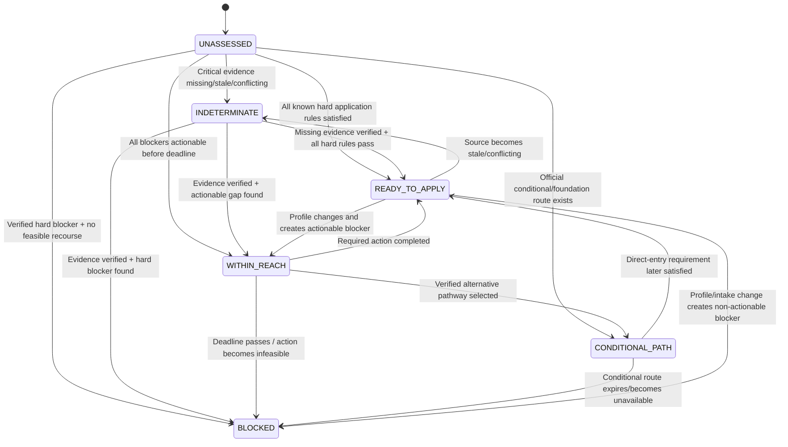
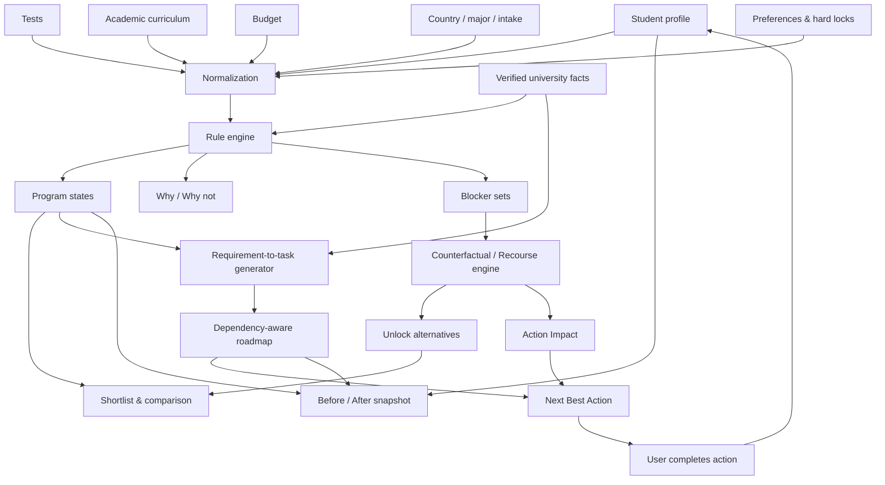
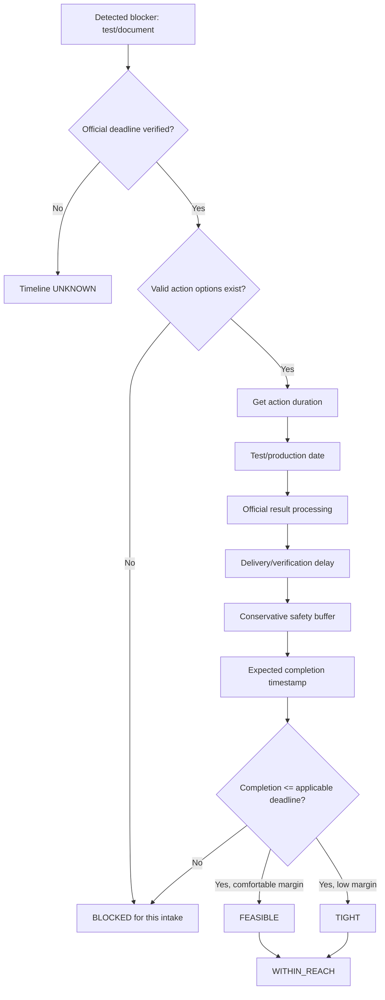

> Редакторское примечание к переносу, 2026-09-17. Ниже полностью сохранён предоставленный пользователем отчёт; admissions-факты при переносе заново не проверялись. Даты проверки и статусы VERIFIED внутри текста относятся к исходному исследованию.
>
> Provenance: OFFICIAL FACT / OFFICIAL_FACT — утверждение исходного отчёта об официальном источнике; PATHSHIFT INFERENCE / PATHSHIFT_INFERENCE — вывод или кодирование логики PathShift; PRODUCT ASSUMPTION / PRODUCT_ASSUMPTION — продуктовое либо тестовое допущение; UNKNOWN — неподтверждённое значение. Эти категории нельзя смешивать. Рекомендации по архитектуре, псевдокод и демонстрационные числа сами по себе не являются правилами вузов.
>
> Служебные маркеры цитирования ChatGPT (`cite…`, `filecite…`) сохранены как исходная provenance-разметка, но вне исходной беседы не являются самостоятельными доступными ссылками. Используйте явные URL в тексте; если точную связь claim → source URL → scope/intake установить нельзя, её статус остаётся UNKNOWN. Не восстанавливайте URL по догадке и не считайте повторяющиеся citation IDs в двух отчётах одним источником.
## Примечания для передачи Codex

- Источник: `1 ресерч чатгпт.md`, предоставленный пользователем. Основной текст ниже сохранён без сокращений и исправлений.
- Состав: executive summary, 18 candidate programs/pathways, Q1–Q50, source matrix, state machine, dependency graph, timeline feasibility, evaluation skeleton и acceptance suite.
- В Q50 заявлено «18 acceptance tests», но исходная таблица фактически содержит **20 тестов A–T**. Сохранены все 20; расхождение в исходной формулировке не скрыто.
- Числа в демонстрационной сцене (например, количество доступных программ и снятых blockers) — иллюстрация продукта, а не рассчитанные результаты dataset freeze.
- Для реализации сопоставьте концептуальный отчёт с [последующим dataset freeze](pathshift-data-freeze.md), учитывая его UNKNOWN и отмеченные противоречия. Это примечание не добавляет новых admissions-фактов.

---
# PathShift — Admission Digital Twin: спецификация decision engine для international bachelor CS applicants

## Executive summary

PathShift имеет смысл строить **не как систему “оценки шансов поступления”**, а как source-backed decision engine, который отвечает на четыре более защищаемых вопроса:

> **Что в моём текущем профиле уже достаточно для подачи?**  
> **Что конкретно мешает выбранной программе?**  
> **Какие из этих препятствий реально можно устранить до дедлайна?**  
> **Какое действие сильнее всего расширит мои доступные варианты?**

Такой подход лучше соответствует самому Case 2: организаторы требуют связный путь `profile → diagnosis → recommendations → compare → roadmap → next action`, заметное изменение результата после изменения budget/country/exam/interest и требуют источники для фактических требований и дедлайнов. При этом запрещены вымышленная точность и гарантии поступления. fileciteturn0file0

Главный результат research: **одного поля `match_score` или одного статуса `MATCH/NO_MATCH` недостаточно**. Реальные admissions rules оказываются многомерными: Georgia Tech требует SAT/ACT для first-year applicants, UIUC позволяет не сдавать SAT/ACT, но отдельно имеет обязательную English-proficiency логику; Carnegie Mellon применяет разные testing policies по college, включая test-required для School of Computer Science; RIT поддерживает conditional English admission; University of Toronto разделяет поступление в admission category и последующее попадание в CS program; UW–Madison допускает поступление в университет до внутреннего declaration CS major. citeturn2search3turn16search16turn0search16turn12search0turn15search3turn10search9

Поэтому внутри PathShift я рекомендую хранить **несколько ортогональных состояний**, а не сводить всё в одно число:

```text
admission_state:
  READY_TO_APPLY
  CONDITIONAL_PATH
  WITHIN_REACH
  BLOCKED
  INDETERMINATE

evidence_state:
  VERIFIED
  PARTIAL
  STALE
  CONFLICTING
  UNKNOWN

timeline_state:
  FEASIBLE
  TIGHT
  MISSED
  UNKNOWN

cost_state:
  WITHIN_BUDGET
  OVER_BUDGET
  UNKNOWN
```

При этом `READY_TO_APPLY` означает исключительно:

> **«По опубликованным и проверенным hard requirements мы не обнаружили блокирующего условия».**

Он **не означает** “будешь принят”. Purdue прямо описывает holistic review, а UW–Madison указывает, что итог поступления нельзя определить только по отдельным числовым характеристикам профиля. citeturn16search18turn22search12

Вторая ключевая находка — **время является частью eligibility**. Разрыв `IELTS 6.0 → 6.5` теоретически actionable, но перестаёт быть actionable для конкретного intake, если результат нельзя получить/доставить к deadline. IELTS публикует разные сроки выдачи результатов по формату теста; ETS отдельно различает появление TOEFL score и время доставки результата университету; College Board публикует конкретные SAT score-release dates. citeturn7search0turn7search3turn7search5turn7search1

Третья находка — **source provenance и versioning должны быть частью core architecture**, а не README. В январе 2026 TOEFL сменил шкалу; U of T вводит новый Bachelor of Computer Science с сентября 2027; канадский financial-support threshold для study permit обновился 1 сентября 2026; Manchester уже публикует отдельные requirements для 2027 entry. Факт без `scope + intake + retrieved_at + effective period + source` нельзя безопасно превращать в deterministic blocker. citeturn7search2turn15search2turn18search0turn13search1

Четвёртая находка — выигрышная `What-if` механика должна быть **causal**, а не декоративным slider. Research по actionable recourse различает простое контрфактическое состояние и реальные действия, которыми человек может туда попасть; в PathShift это означает, что `IELTS 6.0 → 6.5` должен менять не только карточку университета, но и blockers, feasible paths, roadmap, critical deadline и next action. citeturn5academia48turn5academia49turn6academia24

Для хакатонного MVP оптимальный scope после этого research:

**International first-year applicant → Bachelor/undergraduate CS → Fall 2027 → преимущественно US programs + несколько Canada/UK contrast cases.**

Для academic curriculum я бы глубоко поддержал `IB / A-Level / US-style 12-year curriculum`, а Kazakhstan national curriculum сначала поддерживал **частично**, с честным `UNKNOWN/Needs verification` там, где конкретный университет не публикует country-specific equivalency. Georgia Tech явно признаёт, что зарубежные системы могут не соответствовать американской четырёхлетней модели secondary school; ASU требует completed secondary-school credential и определённый coursework; Illinois требует подтверждения equivalency high-school completion. Поэтому универсальное правило “Kazakhstan diploma = eligible everywhere” создавать нельзя. citeturn16search2turn22search5turn16search13

И главный product thesis после research остаётся сильным:

> **Обычный recommender говорит, куда поступать. PathShift показывает, что именно должно измениться, чтобы изменился набор реально доступных путей — и доказывает каждое factual утверждение источником.**

## Исследовательская база и кандидатный dataset

Ниже — 18 программ/траекторий, которые дают хороший набор rule-patterns для demo dataset. Это **не рейтинг вузов**. Цель набора — получить как можно больше логически разных ситуаций для decision engine.

Все URL в таблице проверялись **17.09.2026**. Оценка verification effort — моя инженерная оценка количества взаимосвязанных источников, а не характеристика университета.

| Candidate program | Country | Official program URL | Полезный rule-pattern | Verification effort |
|---|---|---|---|---|
| Carnegie Mellon — School of Computer Science undergraduate | US | `https://www.cs.cmu.edu/education/undergraduate/` | SCS-specific testing, несколько CS bachelor degrees, admission сначала в SCS | High citeturn9search3turn0search16 |
| Georgia Tech — BS Computer Science | US | `https://catalog.gatech.edu/programs/computer-science-bs/` | SAT/ACT required; international curriculum; application/document/test deadlines отдельно | Medium–High citeturn2search3turn16search2turn16search20 |
| UIUC — BS Computer Science | US | `https://siebelschool.illinois.edu/academics/undergraduate/degree-program-options/bs-computer-science` | SAT/ACT optional, English proof отдельным rule | Medium citeturn16search16turn1search13 |
| Purdue — BS Computer Science | US | `https://www.cs.purdue.edu/undergraduate/curriculum/` | holistic review; course preparation; tests не простой hard threshold | Medium citeturn9search13turn0search1turn16search9 |
| UW–Madison — Computer Sciences BA/BS | US | `https://www.cs.wisc.edu/undergraduate/undergrad-program-cs/` | university admission ≠ immediate CS declaration | High citeturn10search9turn11search1 |
| University of Michigan — CS BSE/BS pathways | US | `https://web.eecs.umich.edu/` | strict English route; no conditional English admission | High citeturn10search1turn1search10 |
| University of Washington — BS Computer Science | US | `https://www.cs.washington.edu/academics/undergraduate/` | CS/CE pathways; institution-specific testing/material rules | Medium citeturn10search10turn8search12 |
| RIT — Computer Science BS | US | `https://www.rit.edu/study/computer-science-bs` | required vs preferred academic preparation; conditional English | High citeturn12search3turn12search0 |
| Arizona State — Computer Science BS | US | `https://degrees.asu.edu/bachelors/major/ASU00/ESCSEBS/computer-science` | university OR-rules + program-specific higher standards | High citeturn12search6turn22search1 |
| Waterloo — Computer Science | Canada | `https://uwaterloo.ca/future-students/admissions/admission-requirements/computer-science/high-school/international-system/ib` | exact IB prerequisites + mandatory AIF | Medium citeturn13search2 |
| UBC Vancouver — Computer Science BSc | Canada | `https://you.ubc.ca/programs/computer-science-vancouver-bsc/` | general + degree-specific + English standard | Medium citeturn14search13turn14search12 |
| UBC Vancouver — Computer Science BA | Canada | `https://you.ubc.ca/programs/computer-science-vancouver-ba/` | same subject, different faculty/degree requirements | Medium citeturn14search6 |
| UBC Okanagan — Computer Science BA | Canada | `https://you.ubc.ca/programs/computer-science-okanagan-ba/` | campus/faculty distinctions | Medium citeturn14search1 |
| University of Toronto St George — Computer Science / BCS | Canada | `https://web.cs.toronto.edu/bachelor-of-computer-science` | admission category → first-year rules → program enrolment | Very High citeturn15search2turn15search3 |
| University of Toronto Scarborough — BCS | Canada | `https://utsc.utoronto.ca/admissions/programs/computer-science` | direct admission category + prerequisite subjects + competitive range | High citeturn15search5 |
| University of Toronto Mississauga — Computer Science | Canada | `https://www.utm.utoronto.ca/future-students/programs/computer-science` | supplemental application + direct high-school CS category | High citeturn15search0 |
| Manchester — BSc Computer Science with Industrial Experience | UK | `https://www.manchester.ac.uk/study/undergraduate/courses/2027/00559/bsc-computer-science-with-industrial-experience/` | exact A-level/IB subject rules; country-specific mappings | High citeturn13search1turn13search0 |
| Manchester — CS with Integrated Foundation Year | UK | `https://www.manchester.ac.uk/study/undergraduate/courses/2027/12952/bsc-computer-science-with-an-integrated-foundation-year/` | alternative/foundation pathway instead of binary rejection | High citeturn13search8 |

Для hackathon dataset я бы реально загрузил **12–16 из этих 18**, а остальные использовал как test fixtures. Это лучше соответствует Case 2, который прямо разрешает сузить страну/аудиторию и использовать curated/demo data при условии полноценного user journey. fileciteturn0file0

## Admission rules, evidence и program states

**Q1. Какие requirements являются hard constraints, а какие recommendations?**

**Краткий ответ.** Hard constraint можно создавать только когда официальный источник использует недвусмысленную обязательную конструкцию: `required`, `must`, `minimum`, `cannot be waived`, конкретный prerequisite либо обязательный application component. Формулировки `recommended`, `preferred`, `competitive`, `considered`, `if provided` не должны блокировать программу. RIT, например, разделяет required academic preparation и preferred calculus/science; Waterloo публикует конкретные IB prerequisites и обязательный Admission Information Form; UIUC делает SAT/ACT optional, но English proficiency для соответствующей категории applicant'ов является обязательной и не waiverable. citeturn12search1turn13search2turn16search16turn1search13

**Primary-source examples, дата доступа 17.09.2026:** RIT CS — `https://www.rit.edu/study/computer-science-bs` citeturn12search3; Waterloo CS — `https://uwaterloo.ca/future-students/admissions/admission-requirements/computer-science/high-school/international-system/ib` citeturn13search2; UIUC International Requirements — `https://www.admissions.illinois.edu/international-requirements/` citeturn16search16; Purdue criteria — `https://admissions.purdue.edu/become-student/first-year-criteria/` citeturn0search1.

**Implication.** Каждому rule нужны поля `strength = HARD | SOFT | INFO`, `operator`, `scope`, `source_fact_id`, `effective_intake`.

**Rule:**
```text
если official wording ∈ {required, must, minimum, cannot_be_waived}
    и scope точно совпадает applicant/program/intake:
        HARD
иначе если wording ∈ {recommended, preferred, competitive, considered}:
        SOFT
иначе:
        UNKNOWN → не блокировать
```

**Q2. Насколько requirements program-specific?**

**Краткий ответ.** Достаточно часто, чтобы entity `University` была слишком грубой. Минимальная модель должна быть `Institution → School/Faculty → Program/Admission Category → Intake`. CMU School of Computer Science имеет testing policy, отличную от части других colleges; ASU прямо предупреждает, что отдельные degree programs имеют higher aptitude requirements; Manchester публикует course-specific subject requirements; U of T имеет admission categories и последующие program-enrolment rules. citeturn0search16turn12search6turn13search1turn15search3

**Примеры, 17.09.2026:** CMU Admission Consideration — `https://www.cmu.edu/admission/admission/admission-consideration` citeturn0search17; ASU CS — `https://degrees.asu.edu/bachelors/major/ASU00/ESCSEBS/computer-science` citeturn12search6; Manchester CS — `https://www.manchester.ac.uk/study/undergraduate/courses/2027/00559/bsc-computer-science-with-industrial-experience/` citeturn13search1; U of T CMP1 — `https://web.cs.toronto.edu/undergraduate/how-to-apply/cmp1` citeturn15search3.

**Implication.**
```text
program_id != university_id
rule.scope = {
  institution,
  faculty?,
  program?,
  admission_category?,
  applicant_type,
  intake
}
```

Если program-specific page существует, она имеет приоритет над generic university page для program-specific поля.

**Q3. Какие rule types сложнее `score >= threshold`?**

Реально нужны минимум `AND`, `OR`, `ANY_OF`, exemption, optional, preferred, conditional pathway и post-enrolment rules. ASU использует альтернативные aptitude routes; English proficiency почти везде можно удовлетворить несколькими альтернативными тестами; UIUC связывает SAT/ACT с English requirement особым условием; U of T имеет двухэтапный pathway. citeturn22search1turn14search12turn16search16turn15search3

**Примеры, 17.09.2026:** ASU first-year — `https://admission.asu.edu/apply/first-year/admission` citeturn22search1; UBC English — `https://you.ubc.ca/applying-ubc/requirements/english-language-competency/` citeturn14search12; UIUC — `https://www.admissions.illinois.edu/international-requirements/` citeturn16search16; U of T CMP1 — `https://web.cs.toronto.edu/undergraduate/how-to-apply/cmp1` citeturn15search3.

**Data model:** хранить rule как дерево, а не одну колонку threshold.

```text
ALL(
  SECONDARY_COMPLETED,
  ANY_OF(
    IELTS >= X,
    TOEFL >= Y,
    DET >= Z,
    VERIFIED_EXEMPTION
  ),
  ANY_OF(
    GPA >= G,
    SAT >= S,
    ACT >= A,
    CLASS_RANK <= 25%
  )
)
```

**Q4. Как трактовать test-optional?**

`test_optional` означает **отсутствие SAT/ACT не является blocker**. Оно не означает, что все тестовые requirements исчезли. UIUC SAT/ACT optional, но для определённых international applicants остаётся отдельный English-proficiency requirement; UW–Madison сохраняет test-optional policy на соответствующие cycles; Purdue рассматривает scores, если они предоставлены; Georgia Tech требует SAT или ACT. citeturn1search13turn11search9turn0search1turn2search3

**Примеры, 17.09.2026:** UIUC FAQ — `https://www.admissions.illinois.edu/first-year-apply-faq/` citeturn1search13; UW–Madison — `https://admissions.wisc.edu/apply-as-a-freshman/` citeturn11search9; Georgia Tech — `https://admission.gatech.edu/first-year/standardized-tests` citeturn2search3; CMU — `https://www.cmu.edu/admission/admission/admission-consideration` citeturn0search17.

**Rule:**
```text
if test_policy == OPTIONAL and score == MISSING:
    no blocker
elif test_policy == REQUIRED and score == MISSING:
    blocker(TEST_MISSING)
```

Хранить `test_policy` по program + cycle, а не university global.

**Q5. Как моделировать conditional English admission?**

Нельзя превращать любой English gap в `BLOCKED`. RIT прямо имеет full и conditional English thresholds; University of Michigan, наоборот, заявляет отсутствие conditional admission для компенсации недостаточного English proficiency; UBC указывает academic-English development alternatives; Manchester указывает pre-sessional English routes там, где course их допускает. citeturn12search0turn1search10turn14search12turn13search11

**Примеры, 17.09.2026:** RIT — `https://www.rit.edu/admissions/international` citeturn12search0; Michigan — `https://admissions.umich.edu/apply/international-applicants/exams-visas` citeturn1search10; UBC — `https://you.ubc.ca/applying-ubc/requirements/english-language-competency/` citeturn14search12; Manchester — `https://www.manchester.ac.uk/study/undergraduate/courses/2025/00558/bsc-computer-science-and-mathematics/application-and-selection/` citeturn13search11.

**Model:**
```text
english_route:
  DIRECT
  CONDITIONAL
  PRESESSIONAL
  NONE
  UNKNOWN
```

Если официальный conditional route подтверждён, program state становится `CONDITIONAL_PATH`, а не `BLOCKED`.

**Q6. Когда нужен UNKNOWN?**

UNKNOWN — не ошибка. Он нужен, когда отсутствует **критический факт**, источник не относится к нужному cycle/program/applicant type, данные устарели или источники конфликтуют. Особенно опасно делать `AVAILABLE` при неизвестном deadline или country credential equivalency. UBC требует cycle-specific English evidence, CMU поменял TOEFL interpretation после изменения шкалы 2026, а U of T отдельно версионирует изменения BCS с 2027. citeturn14search12turn0search0turn15search2

**Примеры, 17.09.2026:** UBC ELAS — `https://you.ubc.ca/applying-ubc/requirements/english-language-competency/` citeturn14search12; CMU international — `https://www.cmu.edu/admission/admission/international-applicants` citeturn0search0; U of T BCS — `https://web.cs.toronto.edu/bachelor-of-computer-science` citeturn15search2.

**Rule:**
```text
if critical_fact.status in {MISSING, STALE, CONFLICTING}:
    evidence_state = UNKNOWN/PARTIAL
    do_not_infer_pass()
    do_not_infer_fail()
```

Лучше хранить `admission_state` и `evidence_state` отдельно: известный hard blocker может существовать одновременно с incomplete evidence.

**Q7. Как versioning зависит от intake/academic year?**

Сильно. TOEFL сменил scoring scale с 21 января 2026; U of T BCS начинает действовать с сентября 2027; Canada ежегодно обновляет financial threshold; Manchester публикует отдельные course pages по entry year. citeturn7search2turn15search2turn18search0turn13search1

**Примеры, 17.09.2026:** ETS TOEFL — `https://www.eu.ets.org/toefl/test-takers/ibt/scores/get-scores.html` citeturn7search3; U of T — `https://web.cs.toronto.edu/bachelor-of-computer-science` citeturn15search2; Canada IRCC — `https://www.canada.ca/en/immigration-refugees-citizenship/services/study-canada/study-permit/get-documents/financial-support.html` citeturn18search0; Manchester — `https://www.manchester.ac.uk/study/undergraduate/courses/2027/00559/bsc-computer-science-with-industrial-experience/` citeturn13search1.

**Store:**
```text
valid_for_intake
effective_from
effective_until?
retrieved_at
test_taken_after?
academic_year
```

Никаких timeless requirements.

**Q8. Какой source hierarchy нужен?**

Рекомендованный порядок для PathShift:

`program-specific official page → faculty/school official page → university admissions → university finance/international office → government immigration → official testing provider → Common App/application platform → aggregator`.

Program page должен выигрывать в program-specific prerequisites; government — в visa/immigration; ETS/IELTS/College Board — в score release; Common App — в mechanics application, но не заменять университетский requirement. citeturn13search1turn16search20turn18search0turn7search0turn7search1turn8search0

**Примеры, 17.09.2026:** Manchester program — `https://www.manchester.ac.uk/study/undergraduate/courses/2027/00559/bsc-computer-science-with-industrial-experience/` citeturn13search1; Canada IRCC — `https://www.canada.ca/en/immigration-refugees-citizenship/services/study-canada/study-permit/get-documents/financial-support.html` citeturn18search0; Common App — `https://www.commonapp.org/apply/first-year-students/` citeturn8search0.

**Rule:** conflicting facts resolve by **specificity first, authority second, temporal applicability third**; unresolved conflict → `CONFLICTING`, never arbitrary winner.

**Q9. Какие admission data небезопасно брать из aggregators?**

Особенно опасны exact deadlines, test policies, program prerequisites, scholarships, costs и country-equivalency. Public BridgeU materials показывают broad matching, Reach/Match/Safety, fees/deadlines, но официальный source всё равно должен оставаться ground truth для deterministic engine. В исследовании я не нашёл достаточно чистой текущей пары “aggregator explicitly says X / university says Y”, чтобы честно объявить конкретный discrepancy; поэтому такие third-party values нужно считать discovery-only, а не evidence. citeturn21search18turn16search20turn14search12

**Примеры, 17.09.2026:** BridgeU matching — `https://bridge-u.com/platform-overview/matching/` citeturn21search18; Georgia Tech deadlines — `https://admission.gatech.edu/first-year/deadlines` citeturn16search20; UBC ELAS — `https://you.ubc.ca/applying-ubc/requirements/english-language-competency/` citeturn14search12.

**Rule:**
```text
aggregator fact:
    usable_for_discovery = true
    usable_as_hard_blocker = false
unless independently verified by authoritative source
```

**Q10. Как определять freshness/staleness?**

Универсального TTL admissions industry не публикует; его надо задавать по риску поля. Наиболее опасны deadlines, test policy, fee/cost, visa amount, scholarships. Причина — эти данные реально меняются по cycle: Canada financial requirement обновлён с 1 сентября 2026; GT публикует cycle-specific deadlines; TOEFL изменил scale. citeturn18search0turn16search20turn7search2

**Примеры, 17.09.2026:** IRCC financial support — `https://www.canada.ca/en/immigration-refugees-citizenship/services/study-canada/study-permit/get-documents/financial-support.html` citeturn18search0; GT — `https://admission.gatech.edu/first-year/deadlines` citeturn16search20; UBC deadlines — `https://you.ubc.ca/applying-ubc/dates-deadlines/` citeturn14search9.

**Recommendation:**
```text
deadline/test_policy/scholarship → reverify each admission cycle
cost → reverify each academic year
visa amount → reverify before displaying/action
stable program description → longer TTL, but still versioned
```

Если нет evidence о target cycle → не переносить прошлогодний deadline автоматически.

**Q11. Что делать с conflicting sources?**

Во время research чаще встречался не прямой конфликт, а **scope conflict**: generic university policy против school policy, нынешний cycle против будущего, admission-to-university против declaration-of-major. Например CMU generic colleges и SCS имеют разную test policy; U of T admission category и CS program rules относятся к разным стадиям; Manchester 2026/2027 pages нельзя смешивать. citeturn0search16turn15search3turn13search1turn13search11

**Примеры, 17.09.2026:** CMU — `https://www.cmu.edu/leadership/the-provost/campus-comms/2024/2024-08-29.html` citeturn0search16; U of T — `https://web.cs.toronto.edu/undergraduate/how-to-apply/cmp1` citeturn15search3; Manchester — `https://www.manchester.ac.uk/study/undergraduate/courses/2027/00559/bsc-computer-science-with-industrial-experience/` citeturn13search1.

**Rule:**
```text
same field + same scope + same intake + conflicting values
→ evidence_state = CONFLICTING
→ display both sources
→ do not fire deterministic blocker from that field
```

## Деньги, сроки и actionable recourse

**Q12. Что значит “budget” для international applicant?**

Одного `budget = $20k` недостаточно. Университетские cost-of-attendance модели включают tuition, mandatory fees, housing/food, books, transportation и personal expenses; visa financial requirements могут считать деньги иначе. UIUC публикует estimated total cost с отдельными компонентами, RIT разделяет billed и other expenses, Michigan публикует международный budget, Canada требует tuition + living + transport. citeturn2search0turn20search1turn20search9turn18search0

**Примеры, 17.09.2026:** UIUC tuition — `https://www.admissions.illinois.edu/tuition/` citeturn2search0; RIT — `https://www.rit.edu/admissions/tuition-and-fees` citeturn20search1; Michigan — `https://admissions.umich.edu/i-am/international-students` citeturn20search9; Canada — `https://www.canada.ca/en/immigration-refugees-citizenship/services/study-canada/study-permit/get-documents/financial-support.html` citeturn18search0.

**Model:** в onboarding спрашивать:

`Maximum annual education budget, including tuition + required fees + living costs`.

Хранить отдельно `family_budget`, `published_coa`, `visa_funds_requirement`, `aid_confirmed`.

**Q13. Как считать true annual cost?**

Для MVP:

```text
estimated_annual_cost =
 tuition
 + mandatory_fees
 + official_housing_food_estimate
 + books_supplies
 + transportation
 + required_insurance_if_known
 + other_official_personal_estimate
 - confirmed_guaranteed_award
```

Но UI должен показывать диапазон/компоненты, а не притворяться точной кассой. UIUC прямо отмечает вариации по major/housing/lifestyle, RIT разделяет billed/estimated expenses, Michigan указывает program-dependent tuition. citeturn2search0turn20search1turn20search9

**Примеры:** те же официальные cost pages UIUC, RIT, Michigan — дата доступа 17.09.2026. citeturn2search0turn20search1turn20search9

**UX:** `Estimated annual cost before uncertain aid`, раскрывающийся breakdown + source/year. Не смешивать “tuition” и “cost of attendance”.

**Q14. Какие scholarships можно вычитать из cost?**

Только award, который **детерминирован опубликованным правилом и уже гарантирован текущему applicant state**. UBC IMES competitive — нельзя вычитать заранее; RIT generic merit scholarships автоматически рассматриваются, но размер определяется review — нельзя заранее считать конкретный discount; RIT IB Diploma Scholarship имеет более конкретное fixed award rule; UW–Madison содержит как automatic consideration, так и awards requiring additional application. citeturn13search13turn20search7turn2search18

**Примеры, 17.09.2026:** UBC — `https://you.ubc.ca/financial-planning/scholarships-awards-international-students` citeturn13search13; RIT — `https://www.rit.edu/admissions/aid/merit-based-scholarships` citeturn20search7; UW–Madison — `https://admissions.wisc.edu/international-scholarships/` citeturn2search18.

**Model:**
```text
award_type:
 GUARANTEED_RULE
 AUTOMATIC_COMPETITIVE
 APPLICATION_COMPETITIVE
 NEED_BASED
 EXTERNAL
 UNKNOWN
```

Только `GUARANTEED_RULE + eligibility_verified` можно вычитать из hard cost.

**Q15. Можно ли scholarship eligibility сделать deterministic?**

Иногда — да. Например RIT публикует конкретную IB Diploma Scholarship; University of Kansas публикует GPA bands для merit awards, хотя при product ingestion конкретную international applicability нужно перепроверять из-за нюансов wording на странице; RIT Croatia прямо публикует automatic award threshold, но это другой campus и поэтому не должно автоматически переноситься на RIT Rochester. citeturn20search7turn23search14turn20search6

**Примеры, 17.09.2026:** RIT merit — `https://www.rit.edu/admissions/aid/merit-based-scholarships` citeturn20search7; KU — `https://admissions.ku.edu/afford/scholarships` citeturn23search14; RIT Croatia — `https://www.rit.edu/croatia/financial-aid-and-scholarships` citeturn20search6.

**Rule:** fixed scholarship fires only if **every scope condition** is verified: campus, applicant type, intake, admission status, credential, deadline.

**Q16. Как моделировать deadlines?**

Не одним полем. Georgia Tech отдельно публикует application, document и self-reported test deadlines; UBC имеет application, international-scholarship, document, housing, study-permit-related milestones; UW–Madison различает application и material deadlines. citeturn16search20turn14search9turn11search7

**Примеры, 17.09.2026:** GT — `https://admission.gatech.edu/first-year/deadlines` citeturn16search20; UBC — `https://you.ubc.ca/applying-ubc/dates-deadlines/` citeturn14search9; UW–Madison — `https://admissions.wisc.edu/deadlines/` citeturn11search7.

**Model:**
```text
deadline.type =
 APPLICATION
 DOCUMENT
 TEST_SCORE
 SCHOLARSHIP
 HOUSING
 ENROLLMENT_DEPOSIT
 FINAL_TRANSCRIPT
 VISA_RECOMMENDED
```

Каждый deadline хранит timezone, intake, application plan и source.

**Q17. Как определить timeline feasibility IELTS/SAT/TOEFL/documents?**

Нужно считать **не только дату экзамена, но и delivery chain**. IELTS: computer result обычно быстрее paper; TOEFL score становится доступен быстро, но institutional delivery имеет отдельный срок; SAT публикует test-specific release dates; Georgia Tech предупреждает о processing документов. citeturn7search0turn7search3turn7search5turn7search1turn2search7

**Примеры, 17.09.2026:** IELTS — `https://ielts.org/take-a-test/your-results/getting-and-sharing-your-results` citeturn7search0; SAT — `https://satsuite.collegeboard.org/scores/score-release-dates` citeturn7search1; TOEFL — `https://www.eu.ets.org/toefl/test-takers/ibt/scores/get-scores.html` citeturn7search3; ETS institutional delivery — `https://www.ets.org/toefl/institutions/ibt/report-scores.html` citeturn7search5.

**Rule:**
```text
expected_arrival =
 test_date
 + official_result_delay
 + delivery_delay_if_needed
 + safety_buffer

feasible = expected_arrival <= relevant_deadline
```

Safety buffer — продуктовая консервативная надбавка, которую надо показывать как assumption, а не university rule.

**Q18. Какие profile variables actionable?**

Actionable-recourse literature требует отличать изменяемые характеристики от immutable/non-actionable и учитывать реальную стоимость перехода. Для PathShift:

`immutable/history`: citizenship, completed past grades, уже прошедшие school years;  
`actionable`: future IELTS/SAT attempt, unfinished application docs;  
`slow actionable`: future coursework/performance;  
`financial`: budget/support, но не советовать автоматически “найди больше денег”;  
`preference`: country/intake/major — менять только по разрешению пользователя. citeturn5academia48turn6academia24

**Источники, 17.09.2026:** Ustun et al. — `https://arxiv.org/abs/1809.06514` citeturn5academia48; Karimi et al. — `https://arxiv.org/abs/2002.06278` citeturn6academia24; Georgia Tech deadlines показывают time-bound actionable submissions — `https://admission.gatech.edu/first-year/deadlines` citeturn16search20.

**Store:** `mutability`, `earliest_change_date`, `user_willingness`, `effort_band`.

**Q19. Какие counterfactual recommendations плохие?**

Плохой recourse формально достигает target state, но не является реальным действием. Research прямо различает контрфактический destination и feasible intervention. Поэтому PathShift не должен говорить “измени прошлый GPA”, “измени гражданство”, “увеличь доход семьи” или автоматически “поменяй страну”. citeturn5academia48turn6academia24turn6search0

**Примеры-основания, 17.09.2026:** Ustun — `https://arxiv.org/abs/1809.06514` citeturn5academia48; Wachter — `https://arxiv.org/abs/1711.00399` citeturn5academia49; Karimi — `https://arxiv.org/abs/2002.06278` citeturn6academia24.

**Rule:** любые изменения `IMMUTABLE` запрещены; `PREFERENCE` и `FINANCIAL` требуют opt-in; `ACTIONABLE` должен пройти timeline feasibility.

**Q20. Как определить minimal feasible change?**

Не просто минимальная математическая разница, а минимальный **допустимый набор interventions**, который переводит state в более полезный и не нарушает causal/actionability constraints. Это соответствует recourse literature и реальным OR-rules вроде ASU или альтернативных English tests UBC. citeturn5academia48turn6academia24turn22search1turn14search12

**Примеры, 17.09.2026:** Ustun — URL выше; ASU — `https://admission.asu.edu/apply/first-year/admission` citeturn22search1; UBC English — `https://you.ubc.ca/applying-ubc/requirements/english-language-competency/` citeturn14search12.

```text
find all intervention sets
→ remove sets using immutable variables
→ remove timeline-infeasible sets
→ remove hard-preference violations
→ discard dominated sets
→ return 1–3 Pareto-minimal paths
```

Не прятать альтернативы за одним “magic solution”.

**Q21. Как сравнивать IELTS +0.5, SAT, +$3000 budget без fake ROI?**

Не надо превращать их в `84.7 ROI`. Лучше multi-dimensional Action Impact:

```text
Programs unlocked: 4
Priority programs affected: 2
Hard blockers removed: 5
Effort: Medium
Time: 6–8 weeks
Financial requirement: None
Urgency: High
```

Recourse literature поддерживает идею cost-aware interventions, но не даёт универсальной “правильной” шкалы для admissions; поэтому scalar score был бы нашей субъективной моделью. citeturn5academia48turn6academia24

**Источники, 17.09.2026:** Ustun — `https://arxiv.org/abs/1809.06514` citeturn5academia48; Karimi — `https://arxiv.org/abs/2002.06278` citeturn6academia24; IELTS timing — `https://ielts.org/take-a-test/your-results/getting-and-sharing-your-results` citeturn7search0.

**Ranking recommendation:** сначала feasibility, затем user priority, затем number of blockers/opportunities affected, затем effort, затем urgency.

**Q22. Что нельзя использовать для “admission chance”?**

Holistic factors, essays, recommendations, extracurriculars и contextual review нельзя честно превращать в probability без validated institution-specific outcome model. Purdue использует holistic review; UW–Madison описывает индивидуальное review; Manchester foundation applications рассматривает application как целое. Сам Case 2 запрещает вымышленную точность и гарантии. citeturn16search18turn22search12turn13search8 fileciteturn0file0

**Примеры, 17.09.2026:** Purdue profile — `https://www.admissions.purdue.edu/academics/freshmanprofile.php` citeturn16search18; UW–Madison admissions — `https://admissions.wisc.edu/apply-as-a-freshman/` citeturn11search9; Manchester foundation — `https://www.manchester.ac.uk/study/undergraduate/courses/2027/12952/bsc-computer-science-with-an-integrated-foundation-year/` citeturn13search8.

PathShift должен говорить `requirements fit`, `readiness`, `blockers`, `within reach` — не “78% chance”.

## Product logic, UX и roadmap

**Q23. Как существующие admission platforms объясняют recommendations?**

Public materials показывают, что matching уже commodity. BridgeU строит профиль из grades/preferences и выдаёт Reach/Match/Safety; Scoir предлагает preference-based matches, list building и cost comparison; CollegeVine публично продвигает data-driven chancing; Unifrog объединяет course search и application management. citeturn21search18turn21search12turn21search5turn21search13

**Примеры, 17.09.2026:** BridgeU — `https://bridge-u.com/platform-overview/matching/` citeturn21search18; Scoir — `https://www.scoir.com/students-families` citeturn21search12; CollegeVine — `https://www.collegevine.com/admissions-calculator` citeturn21search5; Unifrog — `https://www.unifrog.org/international-schools` citeturn21search13.

**Implication:** “personalized matching” само по себе не differentiation. PathShift должен показывать **causal explanation + recourse + downstream replan**.

**Q24. Есть ли уже настоящий actionable recourse в admissions products?**

В публичных product descriptions, которые удалось проверить, я нашёл matching, chance categories, shortlisting, deadlines, document workflow и AI assistance, но **не нашёл публично подтверждённой механики** “минимальное изменение профиля → exact unlocked programs → automatic downstream roadmap rebuild”. Это bounded finding по исследованным публичным страницам, не утверждение, что такой feature нигде в мире не существует. citeturn21search10turn21search18turn21search2turn21search5

**Примеры, 17.09.2026:** BridgeU overview — `https://bridge-u.com/platform-overview/` citeturn21search10; Scoir app — `https://www.scoir.com/mobile-app-ios` citeturn21search2; BridgeU Bree — `https://bridge-u.com/bree-ai/` citeturn21search4; CollegeVine — URL выше. citeturn21search5

**Implication:** наш white-space — не slider, а **verified recourse engine**.

**Q25. Как обрабатывать no-match?**

Не пустым экраном. Официальные admissions systems сами иногда предоставляют альтернативные pathways: ASU предлагает second major при несоответствии higher-requirement major; Manchester имеет integrated foundation route; UBC направляет applicants, не достигших English standard, к academic-English development options. citeturn22search1turn13search8turn14search12

**Примеры, 17.09.2026:** ASU — `https://admission.asu.edu/apply/first-year/admission` citeturn22search1; Manchester Foundation — `https://www.manchester.ac.uk/study/undergraduate/courses/2027/12952/bsc-computer-science-with-an-integrated-foundation-year/` citeturn13search8; UBC ELAS — URL выше. citeturn14search12

**UX:**
```text
No exact paths under your current hard constraints.

Most common blockers:
Budget → 11 programs
English → 6 programs
Timeline → 4 programs

Closest verified paths:
A. IELTS 6.0 → 6.5
B. Preserve budget, broaden geography
C. Foundation/conditional route
```

**Q26. Как показывать Why / Why not?**

Не LLM paragraph первым экраном, а fired rules:

```text
✓ English requirement verified
✓ Application window open
△ SAT optional, not submitted
✕ Annual cost exceeds your hard budget
? Country credential equivalency not verified
```

ASU, RIT и Waterloo имеют достаточно structured requirements, чтобы такие explanations формировались deterministic. citeturn22search1turn12search1turn13search2

**Примеры, 17.09.2026:** ASU first-year — URL выше; RIT CS — `https://www.rit.edu/study/computer-science-bs`; Waterloo CS — URL выше. citeturn22search1turn12search3turn13search2

Каждая строка должна иметь `source icon → exact official page`.

**Q27. Как визуализировать uncertainty?**

Не процентом confidence, если он не калиброван. Использовать categorical states:

`Verified`, `Partial`, `Needs verification`, `Stale`, `Conflicting`.

Это особенно важно там, где official pages используют qualified language: Purdue English scores формулируются как general expectations, UBC requirements зависят от country/degree, а будущие deadlines меняются по cycle. citeturn11search13turn14search11turn14search9

**Примеры, 17.09.2026:** Purdue English — `https://www.admissions.purdue.edu/apply/engprof-tests.php` citeturn11search13; UBC International HS — `https://you.ubc.ca/applying-ubc/requirements/international-high-schools` citeturn14search11; UBC deadlines — URL выше. citeturn14search9

**Rule:** uncertainty never silently becomes pass.

**Q28. Как показывать Before/After causal diff?**

Counterfactual explanation research исходит из вопроса “что должно измениться, чтобы изменился outcome”, а actionable-recourse research добавляет необходимость реального feasible action. Для UX PathShift должен показывать **diff только тех downstream entities, которые реально изменились**. citeturn5academia49turn6academia24

**Источники, 17.09.2026:** Wachter — `https://arxiv.org/abs/1711.00399` citeturn5academia49; Karimi — `https://arxiv.org/abs/2002.06278` citeturn6academia24; ASU OR-rules дают реальный admissions example — `https://admission.asu.edu/apply/first-year/admission`. citeturn22search1

```text
IELTS 6.0 → 6.5

Before                    After
RIT: conditional    →     direct English threshold
Program X: blocked  →     within reach
English task        →     completed/removed
Next action         →     transcript preparation
```

**Q29. Как избежать “slider просто фильтрует карточки”?**

Recalculation должен проходить через dependency graph. Causal-recourse literature специально предупреждает, что желаемое counterfactual state и путь действий к нему — разные вещи. В admissions downstream dependencies реальны: score availability зависит от даты test, application status — от deadline, roadmap — от program requirements. citeturn6academia24turn7search1turn16search20

**Примеры:** Karimi paper; SAT release; GT deadlines — все дата доступа 17.09.2026. citeturn6academia24turn7search1turn16search20

```text
profile mutation
→ normalize
→ reevaluate factual predicates
→ recompute blocker sets
→ recompute pathways
→ recompute compare facts
→ rebuild roadmap dependency graph
→ choose next action
```

**Q30. Какой minimum roadmap выглядит персональным?**

Как минимум он должен выводиться из **конкретного shortlist и его requirements**, а не из generic template. Common App показывает, что colleges могут требовать разные materials; GT имеет отдельные deadlines для application/documents/tests; UBC отправляет applicant-specific required-document instructions. citeturn8search0turn16search20turn14search3

**Примеры, 17.09.2026:** Common App — `https://www.commonapp.org/apply/first-year-students/` citeturn8search0; GT deadlines — URL выше; UBC documents — `https://you.ubc.ca/applying-ubc/applied/submit-documents` citeturn14search3.

Минимум:
`requirement → task → dependency → due date → affected programs → source → status`.

**Q31. Какие tasks можно deduplicate?**

Shared artefacts — transcript preparation, common English test, basic Common App profile, иногда recommendation — могут быть one-to-many. Но institution supplement, program supplement и отдельные documents должны оставаться program-specific. Common App сама разделяет общие profile/supporter components и college requirements; U of T CS требует supplement; GT имеет institution-specific document timelines. citeturn8search0turn15search11turn16search20

**Примеры, 17.09.2026:** Common App guide — URL выше; U of T required docs — `https://internationalprograms.utoronto.ca/international-foundation-program/prospective-students/how-to-apply/required-documents/` citeturn15search11; GT documents — `https://admission.gatech.edu/apply/documents` citeturn2search7.

**Rule:** dedupe by artifact identity, не по одинаковому названию task.

**Q32. Как country switch должен менять roadmap?**

Сильно. США: institution application + US-specific testing/policies + после admission I-20/F-1 route; Canada: study permit, PAL/TAL и financial-support evidence; UK: UCAS/course application + CAS/Student visa + maintenance rules; Germany: admission + visa + proof of financing/blocked-account alternatives. citeturn8search0turn22search9turn18search1turn18search0turn17search3turn19search0

**Примеры, 17.09.2026:** Canada financial proof — URL выше; UK Student Visa — `https://www.gov.uk/student-visa/documents-you-must-provide` citeturn17search3; German Foreign Office — `https://www.auswaertiges-amt.de/en/visa-service/buergerservice/faq/08-finanzierung/606696` citeturn19search0; ASU I-20 — `https://admission.asu.edu/apply/international/admitted/first-year` citeturn22search9.

**Implication:** country must be a root dependency. Для 72-hour MVP я бы не делал четыре полноценных visa-roadmap engines.

**Q33. Какой scope оптимален за 72 часа?**

Рекомендация:

> **Fall 2027 international first-year CS applicant; U.S.-centric 10–12 programs + 3–5 contrasting Canada/UK programs; deep support IB/A-Level/US-style curriculum; partial conservative support other national curricula.**

Почему: U.S. subset уже даёт test-required, test-optional, conditional English, holistic, program-specific rules и разные cost profiles; Canada/UK дают красивый country-switch demo, но full multi-country equivalency слишком быстро раздувает rule space. Case 2 прямо разрешает фокус на одной стране/уровне/аудитории. fileciteturn0file0

Практическая база подтверждается разнообразием CMU, GT, UIUC, RIT, ASU, Waterloo, U of T и Manchester. citeturn0search17turn2search3turn16search16turn12search0turn22search1turn13search2turn15search3turn13search1

## Dataset, edge cases и causal integrity

**Q34. Какие 12–20 программ лучше всего взять в demo dataset?**

Я бы взял первые **16** из candidate table, исключив redundant Manchester foundation и один UBC campus при нехватке времени. Обязательные rule archetypes:

`required SAT`, `test optional`, `conditional English`, `no conditional English`, `OR aptitude`, `strict subject prerequisites`, `admission category`, `major declaration after enrolment`, `foundation pathway`, `competitive scholarship`, `fixed cost components`.

Этот набор подтверждается официальными patterns CMU/GT/UIUC/RIT/ASU/U of T/Manchester. citeturn0search16turn2search3turn1search13turn12search0turn22search1turn15search3turn13search8

**Источники, 17.09.2026:** см. candidate table; ключевые URLs приведены там.

**Rule:** выбирайте universities не по prestige, а по **rule diversity**.

**Q35. Что реально верифицировать за один день?**

Высокая feasibility: program existence, target intake, test policy, English tests, application deadline, major prerequisites, official COA, required application materials. Средняя: scholarships, conditional pathways, country-specific credentials. Низкая: holistic “chance”, GPA cross-system equivalence, future unpublished requirements. Это видно по тому, насколько structured официальные GT, UBC, RIT, Waterloo pages. citeturn16search20turn14search12turn20search1turn13search2

**Примеры, 17.09.2026:** GT deadline; UBC English; RIT COA; Waterloo IB — URLs выше. citeturn16search20turn14search12turn20search1turn13search2

**Recommendation:** сначала 8–10 high-confidence fields × 15 programs, а не 50 fields × 5 programs.

**Q36. Какие edge cases реально ломают naive recommender?**

Официальные sources дают много таких случаев: test optional, но English test всё равно required; conditional admission; first-year admission не равно major admission; less-than-four-year international secondary schooling; alternative aptitude routes; score validity; test scale change; multiple deadlines; missing future deadline; supplemental applications. citeturn16search16turn12search0turn10search9turn16search2turn22search1turn14search12turn7search2turn16search20turn15search11

**Примеры, 17.09.2026:** UIUC, RIT, UW–Madison, GT, ASU — official URLs уже приведены выше.

**Engine implication:** edge case должен быть rule/entity, а не `if university == ...` в frontend.

**Q37. Какие edge cases особенно важны для applicants из Казахстана?**

Четыре группы: school-system equivalency, перевод/формат transcripts, English proof, financial/visa proof. Georgia Tech прямо признаёт международные secondary systems, не совпадающие с четырёхлетней US model; Illinois требует confirmation of high-school completion equivalency и English translations; ASU требует completed secondary credential и official translated records; UK financial evidence rules отдельно включают Kazakhstan в differential-evidence nationality list, хотя доказательство всё равно могут запросить. citeturn16search2turn16search13turn22search5turn17search0

**Примеры, 17.09.2026:** GT International — `https://admission.gatech.edu/international/first-year` citeturn16search2; Illinois country documents — `https://www.archive.admissions.illinois.edu/apply/international/required-documents` citeturn16search13; ASU international — `https://admission.asu.edu/apply/international/first-year` citeturn22search5; UK finance — `https://www.gov.uk/student-visa/money` citeturn17search0.

Не предполагать school system только по `country=Kazakhstan`; хранить фактический curriculum.

**Q38. Можно ли универсально нормализовать GPA?**

Нет безопасного универсального правила для decision engine. Georgia Tech либо использует school GPA в доступной форме, либо применяет собственную institutional recalculation methodology; Purdue отмечает, что GPA как единичная величина не является самостоятельным factor в их review и их reporting conversion не равен admissions formula; UBC показывает country-specific grading context. citeturn16search8turn16search18turn14search11

**Примеры, 17.09.2026:** GT Academic Preparation — `https://admission.gatech.edu/first-year/academic-preparation` citeturn16search8; Purdue Class Profile — URL выше; UBC International High Schools — URL выше. citeturn16search18turn14search11

**Store:**
```text
raw_grade
raw_scale
curriculum
school_reported_gpa?
institution_normalized_value?
normalization_method?
```

Не создавайте собственный “Kazakhstan GPA → 4.0” и не используйте его как hard blocker без university-specific basis.

**Q39. Что делать с 11-летним secondary education из Казахстана для US universities?**

**UNKNOWN на уровне страны.** Исследование не даёт основания создать универсальное US rule. Georgia Tech говорит, что знает системы, которые не вписываются в US four-year secondary model, и для shorter curricula запрашивает дополнительную transcript information; Illinois требует подтверждения equivalency high-school completion; ASU опирается на completed school diploma/certificate и coursework. Это три разных operational patterns. citeturn16search2turn16search13turn22search5

**Примеры, 17.09.2026:** GT, Illinois, ASU — URLs в Q37. citeturn16search2turn16search13turn22search5

**Critical rule:**
```text
if curriculum_years < 12
and no official university-specific equivalency rule:
    credential_state = NEEDS_VERIFICATION
    never reject automatically
    never mark academically verified
```

Это одна из самых важных conservative safeguards для PathShift.

**Q40. Какие scraping/ToS риски?**

Не надо строить MVP на предположении “раз страница публичная, можно массово её скрапить”. Common App имеет Terms of Use и отдельный External Partner API; это уже хороший архитектурный сигнал: для платформенных data flows нужно проверять разрешённый integration path. Для каждого university site exact automated-use permission надо проверять отдельно; в рамках этого research я не подтверждал ToS каждого университета, поэтому статус здесь **UNKNOWN per domain**. citeturn23search9turn23search11

**Примеры, 17.09.2026:** Common App Terms — `https://www.commonapp.org/terms-of-use/` citeturn23search9; Common App Partner API — `https://partners.commonapp.org/` citeturn23search11; Common App public applicant guide — `https://www.commonapp.org/apply/` citeturn23search8.

**MVP recommendation:** curated facts + URLs + manual verification; не зеркалировать целые страницы и не зависеть от unauthorized bulk scraping.

**Q41. Какой Minimum Viable Dataset нужен?**

На основании реально встреченных rules:

```text
Institution / Program
country, campus
program_name
degree
target_intake
application_route

Academic
applicant_type
curriculum support
required subjects
credential completion rule

Testing
SAT/ACT policy
English alternatives
thresholds + component thresholds
score validity
conditional English path

Timeline
application deadline
document deadline
test deadline

Money
tuition
mandatory fees
official living estimate
published COA
scholarship rules

Workflow
required docs
supplement
major/admission-category relationship

Evidence
source URL
retrieved_at
effective cycle
evidence state
```

Эти категории прямо наблюдаются в GT, UBC, RIT, U of T и government financial requirements. citeturn16search20turn14search12turn20search1turn15search3turn18search0

**Q42. Какие assertions можно защищать перед судьёй источником?**

Можно уверенно защищать:

| UI assertion | Что требуется |
|---|---|
| “SAT required” | current program/admissions policy |
| “IELTS requirement met/not met” | exact test rule + applicability |
| “Deadline Jan X” | exact intake/application-plan source |
| “Published annual cost ≈ X” | current official COA page |
| “This is your blocker” | cited rule + deterministic comparison |
| “This action unlocks 4 programs” | audit log before/after rule evaluation |
| “Conditional path exists” | explicit official pathway source |

GT, UBC, RIT и official cost pages позволяют строить именно такие assertions. citeturn2search3turn14search12turn12search0turn20search1

**Примеры, 17.09.2026:** GT testing; UBC ELAS; RIT international; RIT tuition — URLs выше. citeturn2search3turn14search12turn12search0turn20search1

`Next Best Action` должен маркироваться как **PathShift recommendation**, а не university fact.

**Q43. Какие assertions нельзя делать категорично?**

Нельзя: “ты поступишь”, “87% шанс”, “это safe school”, “это лучший университет”, “стипендия точно будет”, если award competitive, “deadline будет такой же в следующем году”, если он не опубликован. Purdue и UW–Madison используют holistic review; UBC IMES competitive; Case 2 запрещает guarantees/fake precision/unconfirmed deadlines. citeturn16search18turn22search12turn13search13 fileciteturn0file0

Безопасный wording:

```text
NOT: You will be admitted.
YES: No published hard application blocker detected.

NOT: 92% match.
YES: 5/6 verified baseline requirements satisfied.

NOT: Safe school.
YES: Meets the published baseline requirements we can verify.

NOT: Guaranteed scholarship.
YES: You meet the published eligibility criteria;
     award is competitive.
```

**Q44. Как judge может сломать систему?**

Официальный judge scenario прямо предусматривает изменение budget, interest, country или exam и проверку error states. fileciteturn0file0 Реальные rules из research добавляют более жёсткие ситуации. citeturn12search0turn16search20turn14search12turn15search3

40 adversarial scenarios для QA:

1. IELTS отсутствует; 2. IELTS planned; 3. IELTS выше threshold; 4. overall проходит, component нет; 5. IELTS expired; 6. TOEFL old-scale score; 7. TOEFL new-scale score; 8. SAT missing для GT; 9. SAT missing для UIUC; 10. SAT есть, но release после deadline.

11. Budget = 0; 12. budget ровно COA; 13. budget на $1 ниже; 14. tuition within budget, total COA over; 15. competitive scholarship ошибочно “спасает” budget; 16. guaranteed scholarship действительно спасает; 17. cost unknown; 18. current-year cost используется для future intake; 19. currency missing; 20. user raises budget then lowers again.

21. Application deadline passed; 22. app open, docs deadline passed; 23. score deadline раньше application deadline; 24. deadline unknown; 25. timezone boundary; 26. test feasible theoretically but score delivery late.

27. Country changes US→Canada; 28. US→UK; 29. major CS→Medicine unsupported; 30. admission category differs from intended major; 31. university admitted but CS declaration later; 32. conditional English available; 33. conditional English unavailable.

34. Kazakhstan national curriculum with no explicit equivalency; 35. IB requirements complete; 36. prerequisite math missing; 37. prerequisite math is preferred, not required; 38. two sources conflict; 39. source stale; 40. all 15 programs return no exact path.

У каждого из 40 должен быть deterministic expected state.

**Q45. Какие input changes должны каскадно менять downstream?**

| Input | Eligibility | Ranking | Compare | Roadmap | Next action |
|---|---:|---:|---:|---:|---:|
| IELTS/TOEFL | Yes | Yes | Yes | Yes | Yes |
| SAT/ACT | Только где relevant | Possibly | Yes | Yes | Yes |
| Budget | Cost state | Yes | Yes | Possibly | Possibly |
| Target country | Massive | Massive | Massive | Massive | Massive |
| Intake | Massive | Yes | Yes | Massive | Massive |
| Major | Program universe | Massive | Massive | Massive | Massive |
| Preference “city size” | No hard eligibility | Yes | Yes | Usually no | Usually no |
| Completed roadmap task | Profile/state dependent | Possibly | No/yes | Yes | Yes |

Pattern следует из program policies, deadlines и country-specific immigration workflows. citeturn16search20turn18search0turn17search3turn19search0

**Q46. Какие изменения НЕ должны менять downstream?**

Это критично для ощущения настоящей причинности.

`UI theme` не меняет ничего; `city-size preference` не должна внезапно менять English blocker; изменение SAT не меняет программу, где SAT optional и не используется для отдельного English rule; изменение budget не должно удалять academic requirement; completion essay task не должен “улучшать IELTS”. UIUC test-optional/ELP separation — хороший реальный пример независимых веток. citeturn1search13turn16search16

**Примеры, 17.09.2026:** UIUC FAQ и International Requirements — URLs выше; GT testing показывает противоположный required-policy example. citeturn1search13turn16search16turn2search3

Engine должен использовать dependency mapping, а не global `recalculate everything and randomly rerank`.

**Q47. Как определить closest feasible path?**

Использовать constraint relaxation + actionable recourse:

```text
1. Preserve all locked user constraints.
2. Never alter immutable history.
3. Enumerate allowed changes.
4. Reject timeline-infeasible interventions.
5. Evaluate resulting program states.
6. Remove dominated solutions.
7. Return 1–3 minimal alternatives.
```

Эта логика соответствует actionable-recourse literature; official alternatives вроде Manchester foundation и ASU alternate pathway показывают, почему binary reject слишком груб. citeturn5academia48turn6academia24turn13search8turn22search1

**Sources, 17.09.2026:** Ustun, Karimi, Manchester Foundation, ASU — URLs выше.

Не давать country change меньшую “cost”, чем IELTS retake, если пользователь country hard-locked.

**Q48. Когда WITHIN_REACH превращается в BLOCKED из-за времени?**

Когда **все допустимые пути закрытия hard blocker больше не могут завершиться к applicable deadline**. SAT score release dates, IELTS result windows и TOEFL delivery timings позволяют вычислять это, а GT имеет отдельные test-score deadlines. citeturn7search1turn7search0turn7search5turn16search20

**Примеры, 17.09.2026:** College Board score dates — URL выше; IELTS results — URL выше; ETS delivery — URL выше; GT deadlines — URL выше.

```text
if blocker.actionable
and exists(action_path with expected_completion <= deadline):
    WITHIN_REACH
else if hard blocker:
    BLOCKED
```

Лучше label: `Blocked for this intake`, а не “Blocked forever”.

**Q49. Как обрабатывать несколько equivalent unlock paths?**

Хранить alternatives как `ANY_OF` branches. Например English может быть удовлетворён IELTS/TOEFL/DET/exemption; ASU aptitude может удовлетворяться несколькими routes; RIT может иметь direct English или conditional path. citeturn14search12turn22search1turn12search0

**Примеры, 17.09.2026:** UBC English — URL выше; ASU admission — URL выше; RIT International — URL выше. citeturn14search12turn22search1turn12search0

UX:

```text
3 ways to resolve this blocker

A. IELTS 6.5
   fastest estimated route

B. TOEFL threshold
   alternative accepted test

C. Verified exemption
   only if your schooling meets condition
```

Не скрывать B/C только потому, что algorithm выбрал A.

**Q50. Какие acceptance tests докажут causal personalization?**

Минимум нужно доказать три свойства:

1. Relevant input вызывает ожидаемые downstream changes.
2. Irrelevant input **не** меняет несвязанные states.
3. Before/after output полностью воспроизводим из rules.

Это соответствует judge test Case 2 и factual complexity исследованных university policies. fileciteturn0file0 citeturn2search3turn16search16turn12search0turn16search20

Формальный suite из 18 acceptance tests приведён ниже.

## Engineering specification: source matrix, state machine и acceptance tests

### Source matrix

`Freshness` ниже означает applicability к target 2026/27–2027 cycle, а не “источник никогда не изменится”.

| Program | Requirement/evidence | Official source | Freshness | Ambiguity |
|---|---|---|---|---|
| CMU SCS | SCS testing differs by college; international English | `https://www.cmu.edu/admission/admission/admission-consideration` / `.../international-applicants` | Current cycle-aware | Medium: college-specific citeturn0search17turn0search0 |
| Georgia Tech CS | SAT/ACT; intl records; deadlines | `https://admission.gatech.edu/first-year/standardized-tests`; `/international/first-year`; `/first-year/deadlines` | Current 2026–27 | Low for testing/deadlines; medium curriculum equivalency citeturn2search3turn16search2turn16search20 |
| UIUC CS | Test optional + mandatory English logic | `https://www.admissions.illinois.edu/international-requirements/`; `/first-year-apply-faq/` | Current | Low–Medium citeturn16search16turn1search13 |
| Purdue CS | Holistic criteria; course preparation; English | `https://admissions.purdue.edu/become-student/first-year-criteria/`; `/apply/engprof-tests.php` | Current | Medium due holistic wording citeturn0search1turn11search13 |
| UW–Madison CS | university admission + later major declaration | `https://www.cs.wisc.edu/undergraduate/undergrad-program-cs/` | Current | Medium–High due two-stage pathway citeturn10search9 |
| Michigan CS | English proficiency; no conditional English route | `https://admissions.umich.edu/apply/international-applicants/exams-visas` | Current | Low for ELP, high for admission outcome citeturn1search10 |
| UW Seattle CS | CS program + Common App testing/material data | `https://www.cs.washington.edu/academics/undergraduate/`; Common App UW page | Current | Medium citeturn10search10turn8search12 |
| RIT CS | academic prep + conditional English | `https://www.rit.edu/study/computer-science-bs`; `/admissions/international` | Current | Low citeturn12search3turn12search0 |
| ASU CS | general OR aptitude + degree-specific higher criteria | `https://admission.asu.edu/apply/first-year/admission`; CS Degree Search | Fall 2027 dates present | Medium due individual review branch citeturn22search1turn12search6 |
| Waterloo CS | IB prerequisites + AIF | Waterloo CS international IB page | Current | Low for IB; unknown for unsupported curricula citeturn13search2 |
| UBC BSc CS | English + general/degree requirements | UBC CS + ELAS | Current 2026/27 | Medium due curriculum/country selection citeturn14search13turn14search12 |
| UBC BA CS | Arts-specific degree requirements | `https://you.ubc.ca/programs/computer-science-vancouver-ba/` | Current | Low–Medium citeturn14search6 |
| U of T St George CS | admission category → CS program | BCS + CMP1 pages | Explicit 2027 transition | High structural complexity citeturn15search2turn15search3 |
| U of T Scarborough CS | prerequisites + competitive range | `https://utsc.utoronto.ca/admissions/programs/computer-science` | Page includes 2026 deadlines / 2027 program framing | Medium: cycle fields must be separated citeturn15search5 |
| UTM CS | required subjects + supplemental application | `https://www.utm.utoronto.ca/future-students/programs/computer-science` | Current | Medium citeturn15search0 |
| Manchester CS | A-level/IB subject rules | 2027 course page | Explicit 2027 | Low for listed curricula citeturn13search1 |
| Manchester CS Foundation | alternate pathway | 2027 foundation page | Explicit 2027 | Medium; applicant-specific holistic review citeturn13search8 |
| Cross-country finances | visa/financial sufficiency | Canada IRCC / GOV.UK / German Foreign Office | Current Sep 2026 | Low for published rules, but changes over time citeturn18search0turn17search0turn19search0 |

Для каждого extracted fact в БД я бы хранил минимум:

```text
fact_id
entity_id
field
normalized_value
raw_value
scope
source_url
source_type
page_title
retrieved_at
effective_intake
effective_from
effective_until
evidence_state
review_note
```

А rule отдельно:

```text
rule_id
program_id
rule_type
strength
predicate_tree
alternatives_group
source_fact_ids[]
actionability
deadline_dependency
```

Это позволяет изменить source fact без переписывания frontend logic.

### Program state machine

Внутри лучше не использовать слово `Eligible` в смысле “admitted”. `READY_TO_APPLY` означает отсутствие известного published hard blocker.



Важно: параллельно живут `evidence_state`, `timeline_state`, `cost_state`. Например:

```text
admission_state = WITHIN_REACH
evidence_state  = VERIFIED
timeline_state  = TIGHT
cost_state      = OVER_BUDGET
```

Такой applicant может академически закрыть English gap, но всё ещё не соответствовать hard budget preference.

### Dependency graph



Ключевой принцип: `What-if` не редактирует UI cards напрямую. Он создаёт временную копию `Student State`, после чего **тот же rule engine** пересчитывает всё дерево.

### Timeline feasibility flow



Official timing data здесь берётся из College Board/IELTS/ETS, а institutional deadline — из конкретной university page. citeturn7search0turn7search1turn7search3turn7search5turn16search20

### Deterministic evaluation skeleton

Псевдологика, которую можно почти напрямую превратить в backend service:

```text
evaluate_program(student, program, intake):

    facts = load_verified_facts(program, intake)

    if critical_facts_missing_or_conflicting(facts):
        evidence_state = PARTIAL_OR_UNKNOWN
    else:
        evidence_state = VERIFIED

    rules = build_rules(facts)

    results = []
    for rule in rules:
        result = evaluate(rule, student)
        results.append(result)

    hard_failures = verified HARD rules that failed
    unknown_hard_rules = HARD rules that cannot be evaluated

    direct_path = all verified HARD rules pass

    conditional_paths =
        official alternative / conditional routes
        whose prerequisites are satisfied

    recourse_paths =
        feasible interventions for hard_failures
        excluding immutable changes
        excluding user hard-lock violations
        excluding timeline-infeasible actions

    if direct_path and no unresolved critical rule:
        admission_state = READY_TO_APPLY

    elif conditional_paths not empty:
        admission_state = CONDITIONAL_PATH

    elif hard_failures exist and
         every decisive blocker has feasible recourse:
        admission_state = WITHIN_REACH

    elif hard_failures contain non-resolvable blocker:
        admission_state = BLOCKED

    else:
        admission_state = INDETERMINATE

    return:
        state
        why
        blockers
        uncertainty
        recourse_paths
        sources
```

### Adversarial acceptance suite

Эти tests — именно то, что доказывает жюри, что personalization не косметическая. Judge в официальном кейсе сам будет менять budget/country/exam и смотреть reaction продукта. fileciteturn0file0

| Test | Input mutation | Expected deterministic output |
|---|---|---|
| A | GT applicant: SAT missing → valid SAT added | GT `BLOCKED/WITHIN_REACH → READY_TO_APPLY` по testing dimension; unrelated English/cost facts неизменны citeturn2search3 |
| B | UIUC: SAT missing → SAT added | SAT absence до изменения не должен быть hard blocker; program state не должен “магически” unlock только из-за optional test citeturn1search13 |
| C | RIT: IELTS ниже direct threshold, но внутри conditional range | `CONDITIONAL_PATH`, не generic BLOCKED citeturn12search0 |
| D | Michigan: insufficient English | Не создавать fictitious conditional route; hard English gap остаётся citeturn1search10 |
| E | UBC: IELTS overall pass, one component below minimum | English rule fails; overall score alone недостаточен citeturn14search12 |
| F | IELTS improvement completes English requirement | Recompute program state + remove English task + choose new next action |
| G | Same IELTS change for program already English-satisfied | Eligibility unchanged; no artificial movement |
| H | SAT date selected, result release after institutional score deadline | Test blocker becomes timeline-infeasible → `BLOCKED for this intake` citeturn7search1turn16search20 |
| I | Budget changes below published annual cost | `cost_state → OVER_BUDGET`; academic state stays unchanged |
| J | Competitive scholarship discovered | Do not subtract award from hard cost until actually awarded/guaranteed citeturn13search13turn20search7 |
| K | Verified guaranteed fixed award applies | Cost recomputed by exact award; show source |
| L | Application deadline passes while profile unchanged | `timeline_state → MISSED`; path blocked only for target intake |
| M | Deadline source missing for future intake | `timeline_state → UNKNOWN`; do not copy last year's deadline |
| N | US → Canada | University universe, financial proof and roadmap rebuild; IELTS score itself remains same input citeturn18search0turn18search1 |
| O | US → UK | Roadmap switches to UK-specific application/visa requirements; no US I-20 task citeturn17search3 |
| P | Kazakhstan national curriculum; no verified equivalency for Program X | Academic evidence `UNKNOWN/Needs verification`; no auto rejection and no auto pass citeturn16search2turn16search13 |
| Q | User completes common transcript-preparation task | Shared artifact marked ready for every dependent application; institution-specific supplements remain open citeturn8search0turn14search3 |
| R | All current programs blocked | No empty screen: rank verified closest feasible paths by allowed constraint relaxation |
| S | Source for a previously verified hard rule becomes conflicting | `evidence_state → CONFLICTING`; expose both sources; suspend that rule as deterministic blocker |
| T | User changes cosmetic preference/UI theme | Zero changes to eligibility, cost, roadmap and next action |

### Final logic to freeze before implementation

После всего research ядро PathShift я бы зафиксировал именно так:

```text
STUDENT STATE
    ↓
INPUT NORMALIZATION
    ↓
VERIFIED FACT RETRIEVAL
    ↓
RULE TREE EVALUATION
    ↓
────────────────────────────────
Admission state
Evidence state
Timeline state
Cost state
────────────────────────────────
    ↓
WHY / WHY NOT
    ↓
BLOCKER GRAPH
    ↓
FEASIBLE COUNTERFACTUALS
    ↓
MINIMAL UNLOCK PATHS
    ↓
ACTION IMPACT
    ↓
PERSONALIZED SHORTLIST
    ↓
REQUIREMENTS → TASKS
    ↓
TASK DEDUPLICATION
    ↓
DEPENDENCY / DEADLINE GRAPH
    ↓
NEXT BEST ACTION
    ↓
PROGRESS
    ↓
UPDATED STUDENT STATE
    ↓
FULL RECALCULATION
```

И есть пять правил, которые нельзя нарушать:

**Первое:** факт без source + scope + target intake не становится hard rule. Это особенно критично из-за cycle-specific deadlines, changing test scales и annual financial figures. citeturn16search20turn7search2turn18search0

**Второе:** `READY_TO_APPLY` никогда не превращается в “likely admitted”. Holistic admissions не позволяют честно вывести такую вероятность из опубликованных baseline requirements. citeturn16search18turn22search12

**Третье:** `What-if` обязан запускать тот же engine, что реальный profile edit. Никаких заранее запрограммированных demo-анимаций.

**Четвёртое:** `Minimal Unlock` может менять только actionable variables и только если изменение успевает произойти до relevant deadline; это согласуется и с actionable-recourse research, и с реальными admissions timelines. citeturn5academia48turn6academia24turn7search0turn7search1

**Пятое:** `UNKNOWN` — полноценный хороший результат. В Case 2 неподтверждённые дедлайны и fake precision прямо запрещены, поэтому “мы пока не можем это подтвердить” для жюри сильнее, чем уверенная галлюцинация. fileciteturn0file0

В результате действительно сильная demo-сцена выглядит не как обычный подбор вузов:

```text
Aruzhan
Kazakhstan
Computer Science
Fall 2027
IELTS 6.0
Budget $X

            ↓

12 programs evaluated

READY TO APPLY        3
WITHIN REACH          5
CONDITIONAL PATH      1
BLOCKED               2
NEEDS VERIFICATION    1

            ↓

PathShift:
“Your highest-impact feasible move is English proficiency.”

            ↓

Simulate:
IELTS 6.0 → 6.5

            ↓

3 program states change
5 English blockers disappear
2 roadmap tasks disappear
1 conditional path becomes direct
Next Best Action changes

            ↓

Judge clicks WHY

Official requirement
Source
Target intake
Retrieved date
PathShift inference

            ↓

Judge drops the budget

            ↓

Academic states remain stable
Cost states change
Shortlist reprioritizes
Closest feasible paths appear

            ↓

Judge changes country

            ↓

Entire country-dependent roadmap rebuilds
```

Именно последний момент превращает **Admission Digital Twin** из красивого названия в реально существующую систему: каждое изменение имеет понятную причинную цепочку, каждое factual решение можно проверить, а система честно знает границу между **verified fact**, **PathShift inference** и **UNKNOWN**.